# MD5 Collision Attack Lab


Copyright © 2018 by Wenliang Du.
This work is licensed under a Creative Commons Attribution-NonCommercial-ShareAlike 4.0 International
License. If you remix, transform, or build upon the material, this copyright notice must be left intact, or
reproduced in a way that is reasonable to the medium in which the work is being re-published.

## 1 Introduction

A secure one-way hash function needs to satisfy two properties: the one-way property and the collision-
resistance property. The one-way property ensures that given a hash value h, it is computationally infeasible
to find an input M, such that hash(M) = h. The collision-resistance property ensures that it is computationally
infeasible to find two different inputs M1 and M2 , such that hash(M1) = hash(M2).
Several widely-used one-way hash functions have trouble maintaining the collision-resistance property.
At the rump session of CRYPTO 2004, Xiaoyun Wang and co-authors demonstrated a collision attack
against MD5 [1]. In February 2017, CWI Amsterdam and Google Research announced the SHAtteredattack,
which breaks the collision-resistance property of SHA-1 [3]. While many students do not have trouble
understanding the importance of the one-way property, they cannot easily grasp why the collision-resistance
property is necessary, and what impact these attacks can cause.
The learning objective of this lab is for students to really understand the impact of collision attacks, and
see in first hand what damages can be caused if a widely-used one-way hash function’s collision-resistance
property is broken. To achieve this goal, students need to launch actual collision attacks against the MD
hash function. Using the attacks, students should be able to create two different programs that share the
same MD5 hash but have completely different behaviors. This lab covers a number of topics described in
the following:

- One-way hash function, MD
- The collision-resistance property
- Collision attacks

**Readings.** Detailed coverage of the one-way hash function can be found in the following:

- Chapter 22 of the SEED Book,_Computer & Internet Security: A Hands-on Approach,_ 2nd Edition,
    by Wenliang Du. See details at https://www.handsonsecurity.net.

**Lab Environment.** You can perform the lab exercise on the SEED VM provided by the Cloudlabs. 

Files needed for this lab are included in Labsetup.zip, which can be fetched by running the following commands in the terminal.

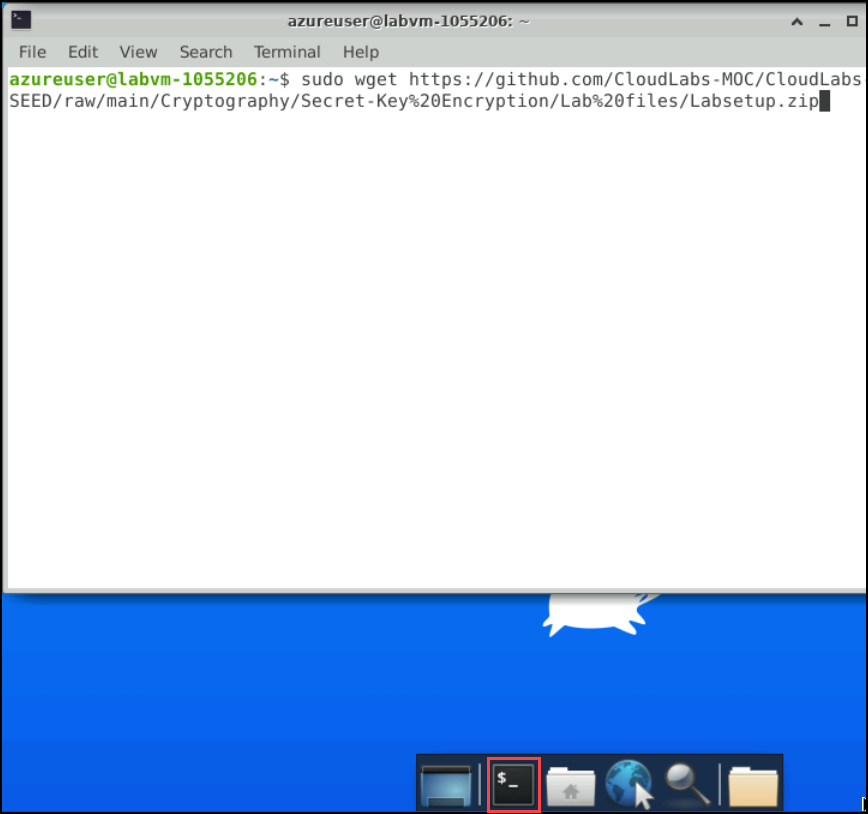

```
sudo wget https://github.com/CloudLabs-MOC/CloudLabs-SEED/raw/main/Cryptography/One-Way%20Hash%20Function/MD5%20Collision%20Attack%20Lab/Lab%20files/Labsetup.zip
```

```
sudo unzip Labsetup.zip
```

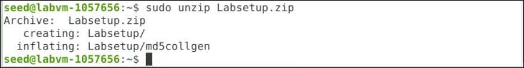

If you are interested in installing the tool to your own machine, you can download the source code directly
from https://www.win.tue.nl/hashclash/.

**Acknowledgment** This lab was developed with the help of Vishtasp Jokhi, a graduate student in the De-
partment of Electrical Engineering and Computer Science at Syracuse University.


## 2 Lab Tasks

### 2.1 Task 1: Generating Two Different Files with the Same MD5 Hash

In this task, we will generate two different files with the same MD5 hash values. The beginning parts of these
two files need to be the same, i.e., they share the same prefix. We can achieve this using the md5collgen
program, which allows us to provide a prefix file with any arbitrary content. The way how the program works
is illustrated in Figure 1.

- Run the following commands to create a prefix file.

```
cd Labsetup
```

```
sudo mv md5collgen /usr/local/bin/
```

```
sudo touch prefix.txt
```

```
echo "abcde"> prefix.txtls
```


The following command generates two output files out1.bin and out2.bin,
for a given a prefix file prefix.txt:
```
md5collgen -p prefix.txt -o out1.bin out2.bin
```
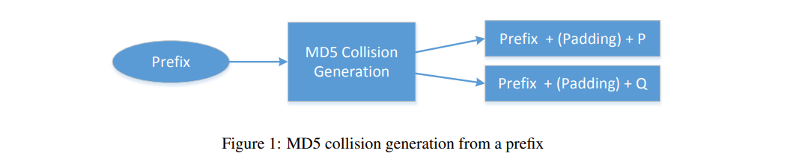

We can check whether the output files are distinct or not using the diff command. We can also use the
md5sum command to check the MD5 hash of each output file. See the following commands.
```
diff out1.bin out2.bin
md5sum out1.bin
md5sum out2.bin
```
Since out1.bin and out2.bin are binary, we cannot view them using a text-viewer program, such
as cat or more; we need to use a binary editor to view (and edit) them. We have already installed a hex
editor software called bless in our VM. Please use such an editor to view these two output files, and
describe your observations.

```
hexdump out1.bin>h1
```

```
hexdump out2.bin>h2
```

To identify the byte difference please run the following command: 
```
diff h1 h2
```

We have highlighted a few differences in the screenshot below, and you can identify the rest likewise.
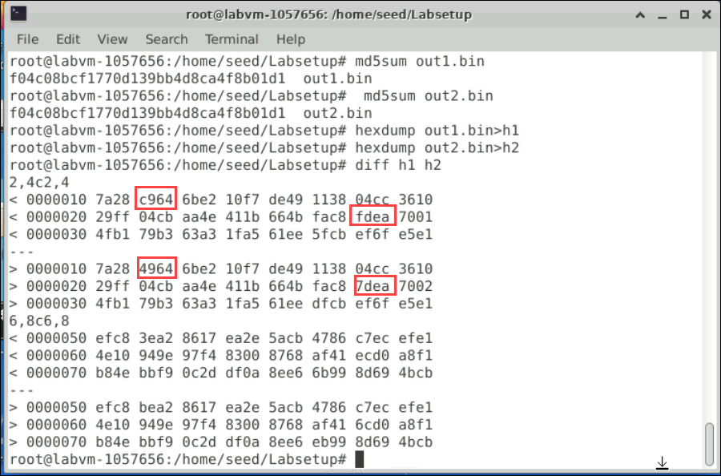


In addition, you should answer the following questions:

- Question 1.If the length of your prefix file is not multiple of 64, what is going to happen?
- Question 2.Create a prefix file with exactly 64 bytes, and run the collision tool again, and see what
    happens.
- Question 3. Are the data (128 bytes) generated by md5collgen completely different for the two
    output files? Please identify all the bytes that are different.

> ℹ️ **Note:**
- Question 1(Ans): If the length of your prefix file is not a multiple of 64, it means that the number of bytes in your file is not evenly divisible by 64. In other words, there will be some remaining bytes that do not complete a full 64-byte block.To make the file's size a multiple of 64 bytes, padding bytes are added to the end of the file. These padding bytes do not contain meaningful data and are typically filled with zeros or some other filler value.

- Question 2(Ans):
  Run the following command to create prefix file with 64 bytes.

   ```
   touch prefix64bit.txt
   ```

  We are using the Python print command to create a prefix file with 64 bytes, it will write the word 'A' 64 times.

  ```
  echo "$( python3 -c 'print("A"*63)')"> prefix64bit.txt
  ```

  Run the following command to view the size of the file.

   ```
   ls -l prefix64bit.txt
   ```

   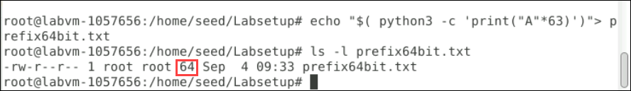

   ```
   md5collgen -p prefix64bit.txt -o out12.bin out22.bin
   ```

   ```
   diff out12.bin out22.bin
   ```

  
- Question 3(Ans):
  No, the data generated by md5collgen for the two output files is not completely different. In fact, the purpose of md5collgen is to generate two distinct files that have the same MD5 hash, meaning that they share a significant portion of their data. To identify the bytes differences please run the following commands:
    ```
    hexdump out12.bin>h12
    hexdump out22.bin>h22
    ```

    ```
    diff h1 h2
    ```

  We have highlighted a few differences in the screenshot below, and you can identify the rest likewise.
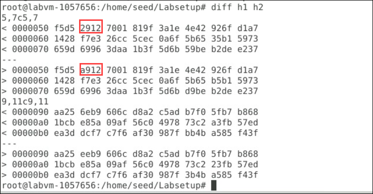
### 2.2 Task 2: Understanding MD5’s Property

In this task, we will try to understand some of the properties of the MD5 algorithm. These properties are
important for us to conduct further tasks in this lab. MD5 is a quite complicated algorithm, but from very
high level, it is not so complicated. As Figure 2 shows, MD5 divides the input data into blocks of 64 bytes,
and then computes the hash iteratively on these blocks. The core of the MD5 algorithm is a compression
function, which takes two inputs, a 64-byte data block and the outcome of the previous iteration. The
compression function produces a 128-bit IHV, which stands for “Intermediate Hash Value”; this output is
then fed into the next iteration. If the current iteration is the last one, the IHV will be the final hash value.
The IHV input for the first iteration (IHV 0 ) is a fixed value.

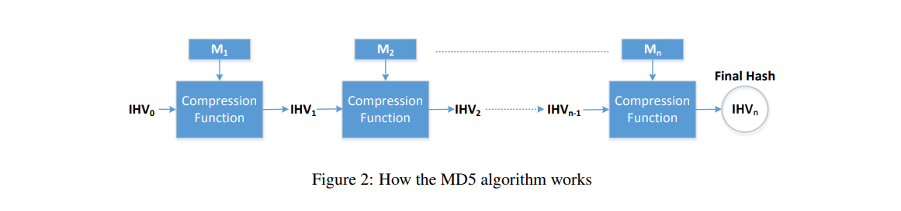

Based on how MD5 works, we can derive the following property of the MD5 algorithm: Given two
inputs M and N, if MD5(M) = MD5(N), i.e., the MD5 hashes ofMandNare the same, then for any input
T,MD5(M ‖ T) = MD5(N ‖ T), where‖represents concatenation.
That is, if inputs M and N have the same hash, adding the same suffix T to them will result in two outputs
that have the same hash value. This property holds not only for the MD5 hash algorithm, but also for many
other hash algorithms. Your job in this taskis to design an experiment to demonstrates that this property
holds for MD5.
You can use the cat command to concatenate two files (binary or text files) into one. The following
command concatenates the contents of file2 to the contents of file1, and places the result in file3.
```
$ cat file1 file2 > file3
```

From the previous task, you should already have three files. Let's start by checking the MD5 values of out1.bin and out2.bin. Run the following commands:

```
md5sum out1.bin
```

```
md5sum out2.bin
```

The MD5 values are the same for these files. We will consider the first file as "M" and the second file as "N".Now, let's add out22.bin file and check its MD5 value, which will differ from out1.bin and out2.bin: 

```
md5sum out22.bin
```

Next, we will concatenate files using the cat command:

```
cat out1.bin out22.bin > comp1
```

```
cat out2.bin out22.bin > comp2
```

Now, let's compare the contents of comp1 and comp2:

```
diff comp1 comp2
```

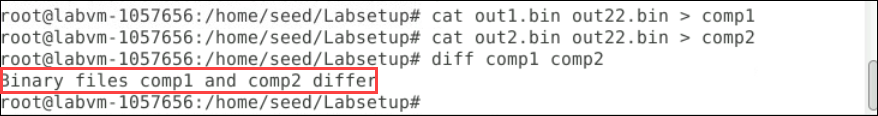

As you can see, there is a difference between the contents of comp1 and comp2. Now, run the following commands to check the MD5 values of comp1 and comp2:

```
md5sum comp1
```

```
md5sum comp2
```

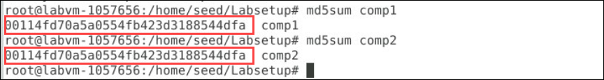

The MD5 values are the same for both comp1 and comp2.

### 2.3 Task 3: Generating Two Executable Files with the Same MD5 Hash

In this task, you are given the following C program. Your job is to create two different versions of this
program, such that the contents of their xyz arrays are different, but the hash values of the executables are
the same.
```
#include <stdio.h>

unsigned char xyz[200] = {
/* The actual contents of this array are up to you */
};

int main()
{
    int i;
    for (i=0; i<200; i++){
        printf("%x", xyz[i]);
    }
    printf("\n");
}
```
You may choose to work at the source code level, i.e., generating two versions of the above C program,
such that after compilation, their corresponding executable files have the same MD5 hash value. However,
it may be easier to directly work on the binary level. You can put some arbitrary values in the xyz array,
compile the above code to binary. Then you can use a hex editor tool to modify the content of the xyz array
directly in the binary file.

Finding where the contents of the array are stored in the binary is not easy. However, if we fill the array
with some fixed values, we can easily find them in the binary. For example, the following code fills the array
with 0x41, which is the ASCII value for letter A. It will not be difficult to locate 200A’s in the binary.

```
unsigned char xyz[200] = {
0x41, 0x41, 0x41, 0x41, 0x41, 0x41, 0x41, 0x41, 0x41, 0x41,
0x41, 0x41, 0x41, 0x41, 0x41, 0x41, 0x41, 0x41, 0x41, 0x41,
0x41, 0x41, 0x41, 0x41, 0x41, 0x41, 0x41, 0x41, 0x41, 0x41,
... (omitted) ...
0x41, 0x41, 0x41, 0x41, 0x41, 0x41, 0x41, 0x41, 0x41, 0x41,
}
```
**Guidelines.** From inside the array, we can find two locations, from where we can divide the executable
file into three parts: a prefix, a 128-byte region, and a suffix. The length of the prefix needs to be multiple
of 64 bytes. See Figure 3 for an illustration of how the file is divided.
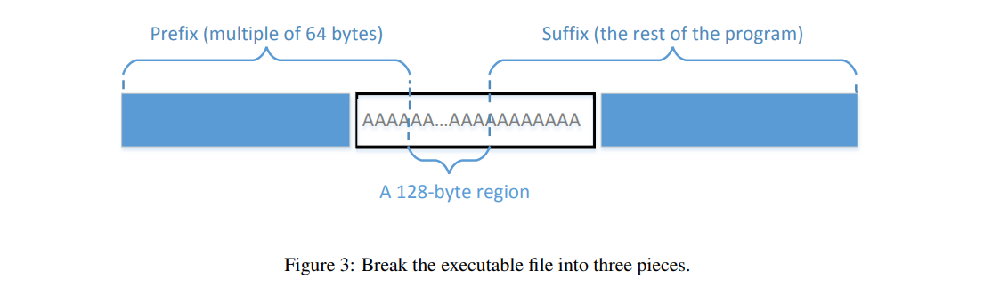
We can run md5collgen on the prefix to generate two outputs that have the same MD5 hash value.
Let us use P and Q to represent the second part (each having 128 bytes) of these outputs (i.e., the part after
the prefix). Therefore, we have the following:
```
MD5(prefix ‖ P) = MD5(prefix‖ Q)
```
Based on the property of MD5, we know that if we append the same suffix to the above two outputs, the
resultant data will also have the same hash value. Basically, the following is true for any suffix:
```
MD5 (prefix ‖ P ‖ suffix) = MD5 (prefix‖ Q ‖ suffix)
```
Therefore, we just need to use P and Q to replace 128 bytes of the array (between the two dividing
points), and we will be able to create two binary programs that have the same hash value. Their outcomes
are different, because they each print out their own arrays, which have different contents.

**Tools.** You can use bless to view the binary executable file and find the location for the array. For
dividing a binary file, there are some tools that we can use to divide a file from a particular location. The
head and tail commands are such useful tools. You can look at their manuals to learn how to use them.
We give three examples in the following:
```
$ head -c 3200 a.out > prefix
$ tail -c 100 a.out > suffix
$ tail -c +3300 a.out > suffix
```
The first command above saves the first 3200 bytes of a.out to prefix. The second command saves
the last 100 bytes of a.out to suffix. The third command saves the data from the 3300th byte to the
end of the file a.out to suffix. With these two commands, we can divide a binary file into pieces from
any location. If we need to glue some pieces together, we can use the cat command.
If you use bless to copy-and-paste a block of data from one binary file to another file, the menu item
"Edit -> Select Range" is quite handy, because you can select a block of data using a starting point
and a range, instead of manually counting how many bytes are selected.

- To perform this task you can follow the instructions given below.

Create a C program by running the following commands:

```
nano task3.c
```

Copy and paste the following content into the file:
```
#include <stdio.h>
unsigned char xyz[200] = {
    "ssssssssssssssssssssssssssssssssssssssssssssssssss"
    "ssssssssssssssssssssssssssssssssssssssssssssssssss"
    "ssssssssssssssssssssssssssssssssssssssssssssssssss"
    "ssssssssssssssssssssssssssssssssssssssssssssssssss"};
int main()
{
    int i;
    for (i = 0; i < 200; i++)
    {
        printf("%x", xyz[i]);
    }
    printf("\n");
}
```

Compile the C program:
```
gcc task3.c

```

```
gcc task3.c -o task3out
```
Run the 'task3out' program:

```
./task3out
```

```
bless task3out
```

Use a hex editor like 'bless' to find the offset value in 'task3out' and replace <VALUE> with the appropriate numeric value:
```
head -c <VALUE> task3out > prefix11
```

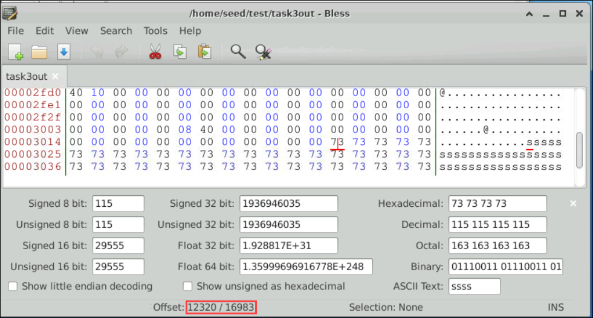

Add 128 to update the value for the 'tail' command:
```
tail -c <VALUE+128> task3out > suffix11
```

Generate MD5 collision files 'out31' and 'out32':
```
md5collgen -p prefix11 -o out31 out32
```

Concatenate 'out31' and 'suffix11' to create 'task3outnew':
```
cat out31 suffix11 > task3outnew
```

Concatenate 'out32' and 'suffix11' to create 'task3outnew2':
```
cat out32 suffix11 > task3outnew2
```

Check the MD5 sums of 'task3out,' 'task3outnew,' and 'task3outnew2':
```
md5sum task3out task3outnew task3outnew2
```

Make 'task3outnew' and 'task3outnew2' executable:
```
chmod +x task3outnew task3outnew2
```

Test 'task3out,' 'task3outnew,' and 'task3outnew2' to print hexadecimal values:
```
./task3out
./task3outnew
./task3outnew2
```


### 2.4 Task 4: Making the Two Programs Behave Differently

In the previous task, we have successfully created two programs that have the same MD5 hash, but their
behaviors are different. However, their differences are only in the data they print out; they still execute the
same sequence of instructions. In this task, we would like to achieve something more significant and more
meaningful.
Assume that you have created a software which does good things. You send the software to a trusted
authority to get certified. The authority conducts a comprehensive testing of your software, and concludes
that your software is indeed doing good things. The authority will present you with a certificate, stating that
your program is good. To prevent you from changing your program after getting the certificate, the MD
hash value of your program is also included in the certificate; the certificate is signed by the authority, so
you cannot change anything on the certificate or your program without rendering the signature invalid.
You would like to get your malicious software certified by the authority, but you have zero chance to
achieve that goal if you simply send your malicious software to the authority. However, you have noticed
that the authority uses MD5 to generate the hash value. You got an idea. You plan to prepare two different
programs. One program will always execute benign instructions and do good things, while the other program
will execute malicious instructions and cause damages. You find a way to get these two programs to share
the same MD5 hash value.
You then send the benign version to the authority for certification. Since this version does good things, it
will pass the certification, and you will get a certificate that contains the hash value of your benign program.
Because your malicious program has the same hash value, this certificate is also valid for your malicious
program. Therefore, you have successfully obtained a valid certificate for your malicious program. If other
people trusted the certificate issued by the authority, they will download your malicious program.
The objective of this taskis to launch the attack described above. Namely, you need to create two programs
that share the same MD5 hash. However, one program will always execute benign instructions, while
the other program will execute malicious instructions. In your work, what benign/malicious instructions are
executed is not important; it is sufficient to demonstrate that the instructions executed by these two programs
are different.

**Guidelines.** Creating two completely different programs that produce the same MD5 hash value is quite
hard. The two hash-colliding programs produced by md5collgen need to share the same prefix; moreover,
as we can see from the previous task, if we need to add some meaningful suffix to the outputs produced by
md5collgen, the suffix added to both programs also needs to be the same. These are the limitations of
the MD5 collision generation program that we use. Although there are other more complicated and more
advanced tools that can lift some of the limitations, such as accepting two different prefixes [2], they demand
much more computing power, so they are out of the scope for this lab. We need to find a way to generate
two different programs within the limitations.
There are many ways to achieve the above goal. We provide one approach as a reference, but students
are encouraged to come up their own ideas. Instructors may consider rewarding students for their own
ideas. In our approach, we create two arrays X and Y. We compare the contents of these two arrays; if they
are the same, the benign code is executed; otherwise, the malicious code is executed. See the following
pseudo-code:
```
Array X;
Array Y;

main()
{
if(X’s contents and Y’s contents are the same)
run benign code;
else
run malicious code;
return;
}
```
We can initialize the arrays X and Y with some values that can help us find their locations in the executable
binary file. Our job is to change the contents of these two arrays, so we can generate two different
versions that have the same MD5 hash. In one version, the contents of X and Y are the same, so the benign
code is executed; in the other version, the contents of X and Y are different, so the malicious code is executed.
We can achieve this goal using a technique similar to the one used in Task 3. Figure 4 illustrates what
the two versions of the program look like.

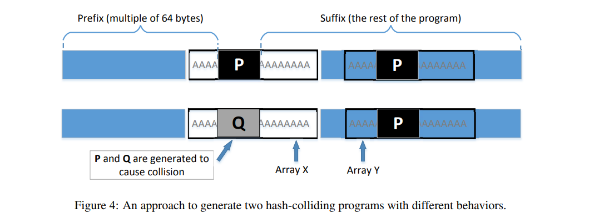

From Figure 4, we know that these two binary files have the same MD5 hash value, as long as P and 
Q are generated accordingly. In the first version, we make the contents of arrays X and Y the same, while
in the second version, we make their contents different. Therefore, the only thing we need to change is the
contents of these two arrays, and there is no need to change the logic of the programs.

- To perform this task you can follow the instructions given below.

Create a directory and open task4.c for editing:

```
mkdir task4
nano task4.c
```

Copy and paste the following in the editor:
```
#include <stdio.h>
#define LEN 300

unsigned char X[LEN] = {
    "AAAAAAAAAAAAAAAAAAAAAAAAAAAAAAAAAAAAAAAAAAAAAAAAAA"
    "AAAAAAAAAAAAAAAAAAAAAAAAAAAAAAAAAAAAAAAAAAAAAAAAAA"
    "AAAAAAAAAAAAAAAAAAAAAAAAAAAAAAAAAAAAAAAAAAAAAAAAAA"
    "AAAAAAAAAAAAAAAAAAAAAAAAAAAAAAAAAAAAAAAAAAAAAAAAAA"
    "AAAAAAAAAAAAAAAAAAAAAAAAAAAAAAAAAAAAAAAAAAAAAAAAAA"
    "AAAAAAAAAAAAAAAAAAAAAAAAAAAAAAAAAAAAAAAAAAAAAAAAAA"};

unsigned char Y[LEN] = {
    "AAAAAAAAAAAAAAAAAAAAAAAAAAAAAAAAAAAAAAAAAAAAAAAAAA"
    "AAAAAAAAAAAAAAAAAAAAAAAAAAAAAAAAAAAAAAAAAAAAAAAAAA"
    "AAAAAAAAAAAAAAAAAAAAAAAAAAAAAAAAAAAAAAAAAAAAAAAAAA"
    "AAAAAAAAAAAAAAAAAAAAAAAAAAAAAAAAAAAAAAAAAAAAAAAAAA"
    "AAAAAAAAAAAAAAAAAAAAAAAAAAAAAAAAAAAAAAAAAAAAAAAAAA"
    "AAAAAAAAAAAAAAAAAAAAAAAAAAAAAAAAAAAAAAAAAAAAAAAAAA"};

int main()
{
    for (int i = 0; i < LEN; i++)
    {
        if (X[i] != Y[i])
        {
            printf("i = %d, X[i] = %.2x, Y[i] = %.2x\n", i, X[i], Y[i]);
            printf("Malicious\n");
            return 0;
        }
    }
    printf("Benign\n");
    return 0;
}
```

Compile task4.c into an executable named task4out:

```
gcc task4.c -o task4out
```

Open task4out in a hexadecimal editor like bless and find the offset values for the 'X' and 'Y' arrays. we are creating a Prefix file from where the X array is starting(ex.4160) then we are leaving 128 bytes and remaining all bytes we are saving in suffix(ex.4288).

```
bless task4out
```

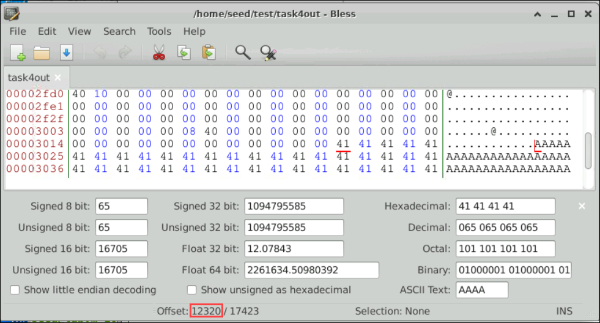

Replace the value with the X array offset value.

```
head -c <VALUE> task4out > prefix
```
Add 128 to the 'X' array offset value and replace the value below:
```
tail -c <+VALUE> task4out > suffix
```

Generate two files out1 and out2 using md5collgen, using the prefix as specified:
```
md5collgen -p prefix -o out1 out2
```

Extract the last 128 bytes from out1 and out2 into P and Q respectively:
```
tail -c 128 out1 > P
tail -c 128 out2 > Q
```

Check the MD5 checksum for out1 and out2:
```
md5sum out1 out2
```
Open the suffix in a hexadecimal editor like bless again and find the 'Y' array offset hexadecimal value.
```
bless suffix
```
Replace the value with Y array offset hexadecimal value.
```
head -c <VALUE> suffix > pre-suffix
```
Add 128 to the 'Y' array offset value and replace the value below:
```
tail -c <+VALUE> suffix > post-suffix
```
Combine the generated files and create benign and malicious.
```
cat out1 pre-suffix P post-suffix > task4benign
cat out2 pre-suffix Q post-suffix > task4malicious
```

Check MD5 values 
```
md5sum task4benign task4malicious
```

Compare task4benign and task4malicious to see if they are different:

```
diff task4benign task4malicious
```


## 3 Submission

You need to submit a detailed lab report, with screenshots, to describe what you have done and what you
have observed. You also need to provide explanation to the observations that are interesting or surprising.
Please also list the important code snippets followed by explanation. Simply attaching code without any
explanation will not receive credits.


## References

[1] John Black, Martin Cochran, and Trevor Highland. A study of the md5 attacks: Insights and improve-
ments. InProceedings of the 13th International Conference on Fast Software Encryption, FSE’06, pages
262–277, Berlin, Heidelberg, 2006. Springer-Verlag.

[2] Marc Stevens. On collisions for md5. Master’s thesis, Eindhoven University of Technology, 6 2007.

[3] Marc Stevens, Elie Bursztein, Pierre Karpman, Ange Albertini, and Yarik Markov. The first collision
for full SHA-1. CWI Amsterdam and Google Research,https://shattered.io/, 2017.


