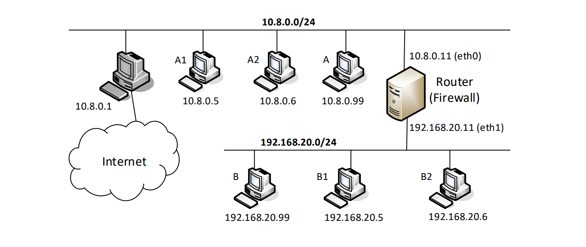
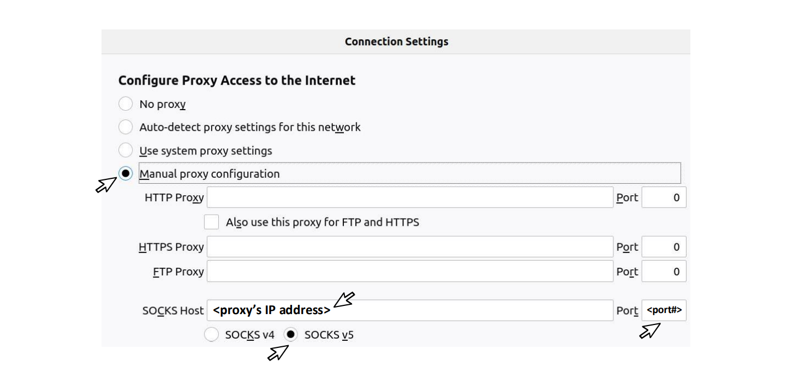

# Firewall Evasion Lab

```
Copyright © 2022 by Wenliang Du.
This work is licensed under a Creative Commons Attribution-NonCommercial-ShareAlike 4.0 International License. If you remix, transform, or build upon the material, this copyright notice must be left intact, or reproduced in a way that is reasonable to the medium in which the work is being re-published.
```
## 1 Overview

There are situations where firewalls are too restrictive, making it inconvenient for users. For example, many companies and schools enforce egress filtering, which blocks users inside of their networks from reaching out to certain websites or Internet services, such as game and social network sites. There are many ways to evade firewalls. A typical approach is to use the tunneling technique, which hides the real purposes of network traffic. There are a number of ways to establish tunnels. The two most common tunneling techniques are Virtual Private Network (VPN) and port forwarding. The goal of this lab is to help students gain hands-on experience on these two tunneling techniques. The lab covers the following topics:

- Firewall evasion
- VPN
- Port forwarding
- SSH tunneling

**Readings and videos.** Detailed coverage of the tunneling technology and how to use it to evade firewalls can be found in the following:

- Chapter 9 of the SEED Book,Internet Security: A Hands-on Approach, 3rd Edition, by Wenliang Du. See details at `https://www.handsonsecurity.net`.

**Lab environment.** This lab has been tested on our pre-built Ubuntu 20.04 VM, which can be downloaded from the SEED website. Since we use containers to set up the lab environment, this lab does not depend much on the SEED VM. You can do this lab using other VMs, physical machines, or VMs on the cloud.

Files needed for this lab are included in Labsetup.zip, which can be fetched by running the following commands.

```
$ sudo wget https://seedsecuritylabs.org/Labs_20.04/Files/Firewall_Evasion/Labsetup.zip
$ sudo unzip Labsetup.zip
```

## 2 Task 0: Get Familiar with the Lab Setup

We will conduct a series of experiments in this chapter. These experiments need to use several computers in two separate networks. The experiment setup is depicted in Figure 1. We use docker containers for these machines. Readers can find the container setup file from the website of this lab. In this lab, the network `10.8.0.0/24` serves as an external network, while `192.168.20.0/24 `serves as the internal network.
<Br>
&emsp; The host `10.8.0.1 `is not a container; this IP address is given to the host machine (i.e., the VM in our case). This machine is the gateway to the Internet. To reach the Internet from the hosts in both `192.168.20.0/24 `and `10.8.0.0/24 `networks, packets must be routed to `10.8.0.1`. The routing has already been set up.



 &emsp; &emsp; &emsp; &emsp; &emsp; &emsp; &emsp; &emsp; &emsp; &emsp; Figure 1: Network setup

**Router configuration: setting up NAT.** The following `iptables` command is included in the router configuration inside the `docker-compose.yml` file. This command sets up a NAT on the router for the traffic going out from its `eth0 `interface, except for the packets to `10.8.0.0/24`. With this rule, for packets going out to the Internet, their source IP address will be replaced by the router’s IP address `10.8.0.11`. Packets going to `10.8.0.0/24` will not go through NAT.
```
iptables -t nat -A POSTROUTING! -d 10.8.0.0/24 -j MASQUERADE -o eth0
```
&emsp; In the above command, we assume that `eth0 `is the name assigned to the interface connecting the router to the `10.8.0.0/24` network. This is not guaranteed. The router has two Ethernet interfaces; when the router container is created, the name assigned to this interface might be `eth1`. You can find out the correct interface name using the following command. If the name is not `eth0`, you should make a change to the command above inside the `docker-compose.yml` file, and then restart the containers.
<pre>
# ip -br address
lo                      UNKNOWN         127.0.0.1/8
eth1@if1907             UP              192.168.20.11/24
<b>eth0</b>@if1909             UP              <b>10.8.0.11/24</b>
</pre>

**Router configuration: Firewall rules.** We have also added the following firewall rules on the router. Please make sure that `eth0` is the interface connected to the `10.8.0.0/24` network and that `eth1` is the one connected to `192.168.20.0/24`. If not, make changes accordingly.
```
// Ingress filtering: only allows SSH traffic
iptables -A FORWARD -i eth0 -p tcp -m conntrack \
         --ctstate ESTABLISHED,RELATED -j ACCEPT
iptables -A FORWARD -i eth0 -p tcp --dport 22 -j ACCEPT
iptables -A FORWARD -i eth0 -p tcp -j DROP

// Egress filtering: block http://www.example.com
iptables -A FORWARD -i eth1 -d 93.184.216.0/24 -j DROP
```
&emsp; The first rule allows TCP packets to come in if they belong to an established or related connection. This is a stateful firewall rule. The second rule allows SSH, and the third rule drops all other TCP packets if they do not satisfy the first or the second rule. The fourth rule is an egress firewall rule, and it prevents the internal hosts from sending packets to `93.184.216.0/24`, which is the network for `www.example.com`.

**Lab task.** Please block two more websites and add the firewall rules to the setup files. The choice of websites is up to you. We will use them in one of the tasks. Keep in mind that most popular websites have multiple IP addresses that can change from time to time. After adding the rules, start the containers, and verify that all the ingress and egress firewall rules are working as expected.

## 3 Task 1: Static Port Forwarding

The firewall in the lab setup prevents outside machines from connecting to any TCP server on the internal network, other than the SSH server. In this task, we would like to use static port forwarding to evade this restriction. More specifically, we will use `ssh` to create a static port forwarding tunnel between host A (on the external network) and host B (on the internal network), so whatever data received on A’s port X will be sent to B, from where the data is forwarded to the target T’s port Y. In the following command, we use `ssh` to create such a tunnel.
```
$ ssh -4NT -L <A’s IP>:<A’s port X>:<T’s IP>:<T’s port Y> <user id>@<B’s IP>

// -4: use IPv4 only, or we will see some error message.
// -N: do not execute a remote command.
// -T: disable pseudo-terminal allocation (save resources).
```
&emsp; Regarding A’s IP, typically we use `0.0.0.0`, indicating that our port forwarding will listen to the connection from all the interfaces on A. If want to limit the connection from a particular interface, we should use that interface’s IP address. For example, if we want to limit the connection to the loopback interface, so only the program on the local host can use this port forwarding, we can use `127.0.0.1:<port>` or
simply omit the IP address (the default IP address is `127.0.0.1`).

**Lab task.** Please use static port forwarding to create a tunnel between the external network and the internal network, so we can telnet into the server on `B1`. Please demonstrate that you can do such telnet from hosts `A, A1 `and `A2`. Moreover, please answer the following questions: (1) How many TCP connections are involved in this entire process. You should run wireshark or `tcpdump` to capture the network traffic, and then point out all the involved TCP connections from the captured traffic. (2) Why can this tunnel successfully help users evade the firewall rule specified in the lab setup?

## 4 Task 2: Dynamic Port Forwarding

In the static port forwarding, each port-forwarding tunnel forwards the data to a particular destination. If we want to forward data to multiple destinations, we need to set up multiple tunnels. For example, using port forwarding, we can successfully visit the blocked `example.com` website , but what if the firewall blocks many other sites, how do we avoid tediously establishing one SSH tunnel for each site? We can use dynamic port forwarding to solve this problem.
<Br>
&emsp; In the lab setup, the router already blocks `example.com`, so hosts on the internal network cannot access the `example.com `website. Please add firewall rules to the router, so two more websites are blocked.
<BR><BR>
The choice of the websites is up to individual students. Please provide evidences to show that the websites are indeed blocked.

#### 4.1 Task 2.1: Setting Up Dynamic Port Forwarding

We can use `ssh `to create a dynamic port-forwarding tunnel between `B` and `A`. We run the following command on host `B`. In dynamic port forwarding, `B `is often called proxy.
```
$ ssh -4NT -D   <B’s IP>:<B’s port X>     <user id>@<A’s IP>
```
&emsp; Regarding B’s IP, typically we use `0.0.0.0`, indicating that our port forwarding will listen to the connection from all the interfaces on B. After the tunnel is set up, we can test it using the `curl` command. We specify a proxy option, so `curl` will send its HTTP request to the proxy B, which listens on port `X`. The proxy forwards the data received on this port to the other end of the tunnel (host A), from where the data
will be further forwarded to the target website. The type of proxy is called SOCKS version 5, so that is why we specify `socks5h`.
```
$ curl --proxy socks5h://<B’s IP>:<B’s port>  <blocked URL>
```
**Lab task.** Please demonstrate that you can visit all the blocked websites using `curl` from hosts `B, B1`, and `B2 `on the internal network. Please also answer the following questions: (1) Which computer establishes the actual connection with the intended web server? (2) How does this computer know which server it should
connect to?

#### 4.2 Task 2.2: Testing the Tunnel Using Browser

We can also test the tunnel using a real browser, instead of using `curl`. Although it is hard to run a browser inside a container, in the docker setup, by default, the host machine is always attached to any network created inside docker, and the first IP address on that network is assigned to the host machine. For example, in our setup, the host machine is the SEED VM; its IP address on the internal network `192.168.20.0/24` is
`192.168.20.1`.
<Br>
&emsp; To use the dynamic port forwarding, we need to configure Firefox’s proxy setting. To get to the setting page, we can type `about:preferences` in the URL field or click the `Preference` menu item. On the `General` page, find the "`Network Settings`" section, click the `Settings` button, and a window will pop up. Follow Figure 2 to set up the SOCKS proxy.

**Lab task.** Once the proxy is configured, we can then browse any website. The requests and replies will go through the SSH tunnel. Since the host VM can reach the Internet directly, to make sure that our web browsing traffic has gone through the tunnel, you should do the following: (1) run `tcpdump` on the router/-firewall, and point out the traffic involved in the entire port forwarding process. (2) Break the SSH tunnel, and then try to browse a website. Describe your observation.

**Cleanup.** After this task, please make sure to remove the proxy setting from Firefox by checking the "`No proxy`" option. Without a proper cleanup, future labs may be affected.



&emsp; &emsp; &emsp; &emsp; &emsp; &emsp; &emsp; &emsp; &emsp; Figure 2: Configure the SOCKS Proxy

#### 4.3 Task 2.3: Writing a SOCKS Client Using Python

For port forwarding to work, we need to specify where the data should be forwarded to (the final destination). In the static case, this piece of information is provided when we set up the tunnel, i.e., it is hard-wired into the tunnel setup. In the dynamic case, the final destination is dynamic, not specified during the setup, so how can the proxy know where to forward the data?
<Br>
&emsp; Applications using a dynamic port forwarding proxy must tell the proxy where to forward their data. This is done through an additional protocol between the application and the proxy. A common protocol for such a purpose is the SOCKS (Socket Secure) protocol, which becomes a de facto proxy standard.
<Br>
&emsp; Since the application needs to interact with the proxy using the SOCKS protocol, the application software must have a native SOCKS support in order to use SOCKS proxies. Both Firefox and `curl` have such a support, but we cannot directly use this type of proxy for the telnet program, because it does not provide a native SOCKS support. In this task, we implement a very simple SOCKS client program using Python.
```
#!/bin/env python
import socks

s = socks.socksocket()
s.set_proxy(socks.SOCKS5, "<proxy’s IP>", <proxy’s port>)
s.connect(("<server’s IP or hostname>", <server’s port>))

hostname = "www.example.com"
req = b"GET / HTTP/1.0\r\nHost: " + hostname.encode(’utf-8’) + b"\r\n\r\n"
s.sendall(req)
response = s.recv(2048)
while response:
    print(response.split(b"\r\n"))
    response = s.recv(2048)
```

**Lab task.** Please complete this program, and use it to access `http://www.example.com `from hosts `B, B1`, and `B2`. The code given above is only for sending HTTP requests, not HTTPS requests (sending HTTPS requests is much more complicated due to the TLS handshake). For this task, students only need to send HTTP requests.

## 5 Task 3: Virtual Private Network (VPN)

VPN is often used to bypass firewall. In this task, we will use VPN to bypass ingress and egress firewalls. OpenVPN is a powerful tool that we can use, but in this task, we will simply use SSH, which is often called the poor man’s VPN. We need to change some default SSH settings on the server to allow VPN creation. The changes made in `/etc/ssh/sshd_config` are listed in the following. They are already enabled inside the containers.
```
PermitRootLogin  yes
PermitTunnel     yes
```
#### 5.1 Task 3.1: Bypassing Ingress Firewall

To create a VPN tunnel from a client to a server, we run the following ssh command. This command creates a TUN interface `tun0` on the VPN client and server machines, and then connect these two TUN interfaces using an encrypted TCP connection. Both zeros in option `0:0 `means `tun0`. Detailed explanation of the `-w` option can be found in the manual of SSH.
```
# ssh -w 0:0 root@<VPN Server’s IP>
```
&emsp; It should also be noted that creating TUN interfaces requires the root privilege, so we need to have the root privilege on both ends of the tunnel. That is why we run it inside the root account, and also SSH into the root account on the server. The above command only creates a tunnel; further configuration is needed on both ends of the tunnel. The following improved command include some of the configuration commands:
<pre>
# ssh -w 0:0 root@<VPN Server’s IP> \
      -o "PermitLocalCommand=yes" \
      -o "LocalCommand= ip addr add 192.168.53.88/24 dev  tun0 && \
                        ip link set tun0 up" \
      -o "RemoteCommand=ip addr add 192.168.53.99/24 dev tun0 && \
                        ip link set tun0 up"
root@<VPN Server’s IP> password: ****  <b><---- Password: dees</b>
</pre>

&emsp; The `LocalCommand `entry specifies the command running on the VPN client side. It configures the client-side TUN interface: assigning the `192.168.53.88/24 `address to the interface and bringing it up. The `RemoteCommand `entry specifies the command running on the VPN server side. It configures the server-side TUN interface. The configuration is incomplete, and further configuration is still needed.

**Lab task.** Please create a VPN tunnel between `A` and `B`, with `B` being the VPN server. Then conduct all the necessary configuration. Once everything is set up, please demonstrate that you can telnet to `B`, `B1`, and  `B2` from the outside network. Please capture the packets trace, and explain why the packets are not blocked by the firewall.


#### 5.2 Task 3.2: Bypassing Egress Firewall

In this task, we will use VPN to bypass egress firewall. In our setup, we have blocked three external websites, so the hosts on the `192.168.20.0/24` cannot access these websites. The objective of this task is to use the VPN tunneling technique to bypass these rules. This objective of is the same as that of Task 2, except that this time, we use VPN, instead of dynamic port forwarding. The command for creating VPN tunnels is
similar to that in Task 3.1. In this task, we use `B` as the VPN client and `A` as the VPN server.
<Br>
&emsp; It should be noted that when a packet generated on the VPN client is sent to the VPN server via the tunnel, the source IP address of the packet will be `192.168.53.88 `according to our setup. When this packet goes out, it will go through VirtualBox’s NAT (Network Address Translation) server, where the source IP address will be replaced by the IP address of the host computer. The packet will eventually arrive at `example.com`, and the reply packet will come back to our host computer, and then be given to the same
NAT server, where the destination address is translated back `192.168.53.88`. This is where the problem comes up.
<Br>
&emsp; VirtualBox’s NAT server knows nothing about the `192.168.53.0/24` network, because this is the one that we create internally for our TUN interface, and VirtualBox has no idea how to route to this network, much less knowing that the packet should be given to VPN server. As a result, the reply packet from `example.com` will be dropped.
<Br>
&emsp; To solve this problem, we will set up our own NAT server on VPN server, so when packets from `192.168.53.88 `go out, their source IP addresses are always replaced by the VPN server `A’s` IP address (`10.8.0.99`). We can use the following command to create a NAT server on the `eth0` interface of the VPN server.
```
# iptables -t nat -A POSTROUTING -j MASQUERADE -o eth0
```
**Lab task.** Please set up a VPN tunnel between `B` and `A`, with `A` being the VPN server. Please demonstrate that you can use this VPN tunnel to successfully reach the blocked websites from hosts `B, B1` and `B2`. Please capture the packets trace, and explain why the packets are not blocked by the firewall.

## 6 Task 4: Comparing SOCKS5 Proxy and VPN

Both SOCKS5 proxy (dynamic port forwarding) and VPN are commonly used in creating tunnels to bypass firewalls, as well as to protect communications. Many VPN service providers provide both types of services. Sometimes, when a VPN service provider tells you that it provides the VPN service, but in reality, it is just a SOCKS5 proxy. Although both technologies can be used to solve the same problem, they do have significant differences. Based on your experience from this lab, please compare these two technologies, describing their differences, pros and cons.

## 7 Submission

You need to submit a detailed lab report, with screenshots, to describe what you have done and what you have observed. You also need to provide explanation to the observations that are interesting or surprising. Please also list the important code snippets followed by explanation. Simply attaching code without any explanation will not receive credits.


